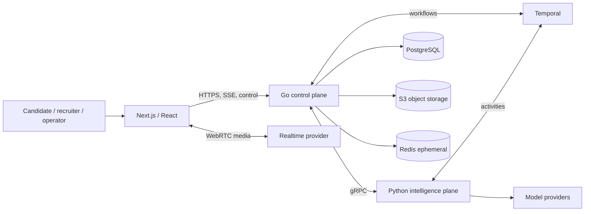

# Architecture and Implementation Brief

**Status:** Proposed  
**Owner:** Principal Engineer  
**Last updated:** 2026-08-23

## Mandate

Build Prepeet as a greenfield multi-tenant, voice-first interview platform using Go, Python, and Next.js/React. The Principal Engineer owns boundary validation, ADRs, the walking skeleton, engineering standards, risk retirement, and measurable release evidence.

The mandate includes:

- validate product, compliance, traffic, latency, retention, and cost assumptions;
- resolve material alternatives through ADRs;
- define and enforce dependency direction and data ownership;
- deliver a walking skeleton across web, Go, Python, PostgreSQL, Temporal, object storage, and realtime/model providers;
- establish contract generation, CI, migrations, testing, observability, security, accessibility, and deployment before feature teams scale;
- define measurable SLOs, RPO/RTO, capacity, and unit economics;
- prove tenant isolation, practice/screen separation, workflow recovery, session reproducibility, evidence traceability, and deletion;
- maintain a risk register, phased plan, and explicit exit criteria;
- document every intentional deviation from the approved target.

The Principal Engineer is expected to challenge assumptions with evidence, not merely translate this brief into code.

## System shape



## Primary deployables

### Go control plane

One modular monolith initially. It owns identity integration, tenancy, candidate product state, session lifecycle, recruiting, authorization, evaluation persistence/publication, media metadata, billing/usage, notifications, integrations, audit, and the public API.

It does not own prompt/model/rubric interpretation or AI coaching policy.

Initial modules are identity, tenancy, candidate, content publication, interview, evaluation persistence, recruiting, media, billing/usage, notification, integration, audit, and platform administration. Each module has its own application boundary and writer even while compiled into one process.

### Python intelligence plane

One cohesive service/worker initially. It owns profile extraction, session composition, interview policy, evidence processing, evaluation, articulation, coaching, provider routing, and offline AI evaluation.

It does not own users, memberships, permissions, invitations, billing, webhooks, or authoritative lifecycle.

Capability boundaries are extraction, session composition, runtime policy, coverage/evidence, turn evaluation, rubric aggregation, consistency, articulation, coaching, readiness narrative, provider gateway, and offline AI evaluation. Provider SDKs remain behind capability-oriented adapters rather than spreading through feature code.

### Next.js/React web

Next.js App Router is the frontend framework. Server Components handle public/read-heavy presentation; Client Components handle WebRTC, microphone, recording, SSE/WebSocket, forms, and interactive dashboards.

Go remains the authoritative backend. Next.js Route Handlers or Server Actions may support presentation/session mechanics but may not duplicate domain logic or direct database access.

Use Server Components for static/public/read-heavy shells and initial reads. Use Client Components for state/effects/browser APIs. TanStack Query manages interactive remote state; React state handles local behavior; Zustand is reserved for the complex live-interview state machine rather than mirroring backend data.

| Workload | Default rendering/state |
|---|---|
| Marketing and role content | Static generation or server rendering |
| Authenticated shell/initial read | Server Component calling Go |
| Dashboard refresh/filter | Client Component + TanStack Query |
| Forms/wizards | Client Component + React Hook Form + Zod |
| Live interview | Client subsystem with explicit state machine |
| Processing progress | SSE |
| Bidirectional control | WebSocket only if required |
| Microphone/recording/WebRTC | Browser APIs in Client Components |

Reconsider plain React/Vite only if the product becomes an entirely authenticated client-side application with no meaningful public content, server rendering, streaming, or shared routing need. Reconsider Next.js if its server runtime creates material operational/security cost without corresponding value; record either change through ADR.

## Core architectural invariants

1. Go owns trusted product state; Python proposes typed intelligence.
2. PostgreSQL is the source of truth.
3. Temporal coordinates durable internal processes; a transactional outbox drives external events.
4. Every tenant-owned path carries and enforces tenant context.
5. Session configuration is immutable after start.
6. Model output cannot directly mutate product state.
7. Redis is never the only copy of important state.
8. Long-running work does not execute as synchronous handler chains.
9. All retryable writes are idempotent.
10. New services require an independent scaling, security, availability, ownership, or release need.

Additional fitness rules:

- API DTOs, domain objects, persistence models, RPCs, and events are separate representations.
- External delivery is at-least-once and consumers deduplicate.
- Cross-module reads use application interfaces or governed projections rather than arbitrary feature SQL joins.
- Model/provider failure is a typed operating condition with a safe degraded path.
- Unknown evaluation evidence is never coerced into a numeric result.
- Restricted content is absent from ordinary telemetry.

## Immutable session bundle

Before readiness, compose and persist:

```text
SessionContextBundle
├── schema version and digest
├── tenant/mode policy snapshot
├── candidate/profile and role/JD snapshots
├── interview blueprint
├── persona reference and rendered form
├── resolved plan and rule pack
├── rubric and tenant calibration
├── role standard and readiness snapshot
├── prompt and model/provider policies
├── experiment assignments
└── composition provenance
```

The live interview, evaluation, review, replay, and audit use the same bundle. A material pre-start change creates a new revision; the bundle cannot change after start.

## Technology baseline

| Concern | Baseline |
|---|---|
| Web | Next.js App Router, TypeScript, TanStack Query, React Hook Form, Zod, Radix, Tailwind |
| Go | `chi`, `pgx`, `sqlc`, `goose` |
| Python | `uv`, Pydantic, Ruff, Pyright, gRPC |
| Contracts | OpenAPI, Protobuf, Buf |
| Workflow | Temporal |
| Data | Managed PostgreSQL, S3-compatible storage, Redis for ephemeral uses |
| Telemetry | OpenTelemetry, metrics/logs/traces, Sentry |
| Infrastructure | Terraform, managed containers, Docker Compose locally |

## Repository structure

```text
prepeet/
├── apps/web/
│   └── src/
│       ├── app/(public|candidate|recruiter|platform)/
│       ├── features/
│       ├── design-system/
│       └── lib/(api|auth|observability|realtime)/
├── services/
│   ├── platform/               # Go
│   │   ├── cmd/(api|worker|migrate)/
│   │   ├── internal/(identity|tenancy|candidate|interview|evaluation|recruiting|media|billing|notification|integration|audit)/
│   │   ├── platform/(database|temporal|observability|objectstore|email|cryptography)/
│   │   └── migrations/
│   └── intelligence/           # Python
│       ├── src/prepeet_ai/(composition|runtime|extraction|evaluation|articulation|coaching|readiness|providers|workflows|transport)/
│       ├── artifacts/(personas|plans|rules|rubrics|role-standards|prompts)/
│       └── evals/(datasets|graders|scenarios)/
├── packages/
│   ├── contracts/(api|rpc|events)/
│   ├── generated/(go|python|typescript)/
│   └── test-fixtures/
├── infrastructure/(terraform|temporal|observability|local)/
├── tools/(contract-check|seed|load-test|prompt-eval|data-migration)/
└── docs/
```

Go modules are organized by bounded context with domain, application, repository, transport, and composition. Frontend code is organized by feature/journey. Python is organized by capability: composition, runtime, extraction, evaluation, articulation, coaching, providers, workflows, and transport.

## Quality attributes

Priority order:

1. Trust and auditability.
2. Tenant isolation and privacy.
3. Reproducibility.
4. Failure recovery.
5. Accessibility and responsible hiring.
6. Evolvability.
7. Cost attribution.

For any completed evaluation, an authorized operator must establish actor/tenant/purpose, consent/retention policy, candidate/job snapshots, every artifact/model/prompt version, evidence for each material conclusion, automated and human changes, external deliveries, and failures/retries.

Reproducibility means reconstructing inputs and the decision path; exact byte-for-byte external model output may be impossible.

## Testing and CI baseline

**Status:** Required

Development is test driven. The failing test is written before the implementation and ships in the same change, and no implementation is merged without a test covering it. This applies to the Next.js frontend exactly as it applies to the Go and Python services: component behaviour, state, routing, realtime and accessibility are covered, not only backend units. Coverage thresholds are enforced in CI per deployable and a drop fails the build.

Test portfolio:

- domain/state and property tests for lifecycle, reducers, idempotency, and authorization;
- contract compatibility across Go/Python/TypeScript/events;
- integration tests against real PostgreSQL, object storage, and Temporal;
- workflow retry/timeout/cancel/replay tests;
- browser permission/device/reconnect/recording/accessibility tests;
- AI regression evaluation for evidence, rubric, articulation, safety, latency, and cost;
- cross-tenant, prompt-injection, privilege, object, and export security tests;
- load tests for start bursts, concurrent sessions, media completion, and evaluation backlog;
- restore and recovery exercises.

Required CI gates include format/lint/type/unit, coverage thresholds per deployable, documentation completeness, empty/prior database migrations, OpenAPI/Protobuf breaking checks, generated drift, module boundaries, image/dependency/secret scans, integration tests, artifact digest/schema validation, AI regression for changed intelligence artifacts, and preview smoke tests.

## Documentation baseline

**Status:** Required

Every exported type, function, endpoint, workflow, and component carries documentation stating which rule it enforces and which invariant it protects, in the idiomatic form for its language. Each module and feature directory carries a README naming what it owns and what it must never do. Documentation explains why rather than restating what the code already says, and completeness is a build gate rather than a review preference.

## Frontend design source

**Status:** Required

The production interface is a port of the high-fidelity prototype in `/screens`, not a fresh design. Design tokens port first and remain the single source of colour, spacing, radius, and motion, followed by components and then screens. The prototype's copy and interaction states port with it, because both were written against the content and accessibility rules in `product/information-architecture.md`. Deviations are recorded with a reason; research findings may override the prototype, developer preference may not.

## Implementation approach

Start with discovery and ADRs, then engineering foundation, a traced walking skeleton, Practice MVP, practice hardening, screening foundation, controlled screening pilot, and only then enterprise scaling/extraction.

Do not initially introduce Kubernetes, Kafka, a dedicated vector database, GraphQL, a service per domain module, whole-system event sourcing, or a custom media server without measured need and an ADR.

## Acceptance

The architecture is viable when a practice interview survives duplicate requests and worker/provider disruption, produces a review traceable to pinned inputs and evidence, proves tenant/practice-screen isolation, supports deletion and recovery, meets accessibility/security gates, and can be operated through documented SLOs/runbooks.

## Related specifications

- [Domain model](domain-model.md)
- [Session lifecycle](session-lifecycle.md)
- [Realtime protocol](realtime-protocol.md)
- [Data architecture](data-architecture.md)
- [Authorization](authorization-model.md)
- [Evaluation](evaluation-system.md)
- [Articulation](articulation-system.md)
- [Architecture decisions](decisions/README.md)
