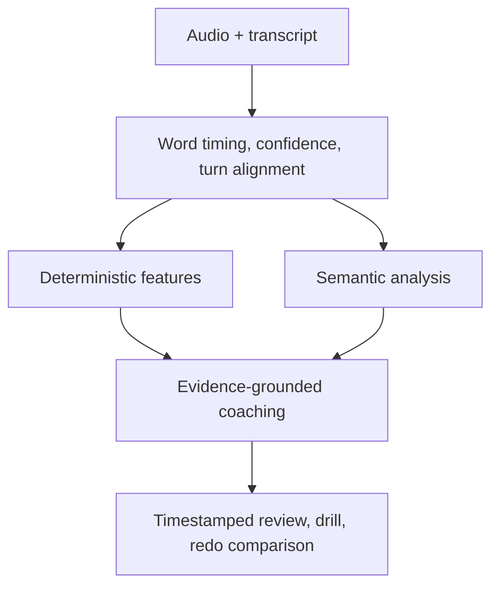

# Articulation System

**Status:** Proposed  
**Owner:** Python intelligence and candidate learning teams  
**Last updated:** 2026-08-23

## Purpose

Help candidates express answers more clearly while preserving their identity and accent. Articulation is a multidimensional practice profile, not a personality or employment score.

## Dimensions

| Dimension | Meaning |
|---|---|
| Structure | Opening, logical progression, evidence, outcome, conclusion |
| Conciseness | Repetition, digression, and time to main answer |
| Fluency | Fillers, false starts, repeated/abandoned phrases |
| Pace | Speaking rate and rushed/slow passages |
| Pausing | Deliberate versus frequent/long hesitation |
| Precision | Specific language and concrete examples |
| Signposting | Language helping the listener follow structure |
| Intelligibility | Understandability without accent conformity |
| Vocal delivery | Observable volume and useful pace/emphasis variation |
| Responsiveness | Directly addressing the question |

Do not collapse these into one opaque percentage.

## Pipeline



Objective features are calculated before model interpretation. A model cannot invent words per minute, pause duration, or recording quality.

## Deterministic measurements

- words per minute and duration;
- response timing for coaching only, never screening scoring;
- pause frequency/distribution/duration;
- fillers normalized per 100 words;
- restarts, repeated phrases, and abandoned sentences;
- sentence/answer length;
- clipping, silence, background noise, volume consistency, and transcript confidence.

Each retains calculator version and input references.

## Assessability

Result status is `assessable`, `partially_assessable`, or `not_assessable`. Low audio quality, insufficient speech, and transcription uncertainty produce warnings/status, never a low candidate result.

## Output

Typed result includes input/calculator/policy versions, assessability, deterministic metrics, dimension levels, transcript/audio evidence, strengths, one or two priorities, suggested structure, and selected drill.

Suggested language preserves facts. Missing evidence uses scaffolds/placeholders rather than fabricated metrics, actions, or outcomes.

Representative contract:

```json
{
  "schema_version": "1.0",
  "turn_id": "turn_uuidv7",
  "assessability": {
    "status": "assessable",
    "audio_quality": 0.91,
    "transcript_confidence": 0.94,
    "warnings": []
  },
  "metrics": {
    "words_per_minute": 172,
    "filler_words_per_100": 4.8,
    "average_pause_ms": 620,
    "long_pause_count": 3,
    "restart_count": 2,
    "repeated_phrase_count": 1
  },
  "dimensions": {
    "structure": {
      "level": "developing",
      "evidence_segment_ids": ["seg_12", "seg_15"]
    },
    "conciseness": {
      "level": "strong",
      "evidence_segment_ids": ["seg_12"]
    }
  },
  "coaching": {
    "strengths": ["You stated the result and supported it with a metric."],
    "priority_action": "State the decision before the background.",
    "suggested_structure": [
      "Lead with the decision",
      "Give one sentence of context",
      "Explain your reasoning",
      "Close with the result"
    ],
    "practice_drill": {"type": "headline_first", "duration_seconds": 60}
  },
  "calculation_version": "articulation-features-v1",
  "policy_version": "articulation-practice-v1"
}
```

Persistence additionally records audio/transcript digests, timestamp mapping, implementation/model/prompt versions, processing attempt, usage, and latency.

## Candidate experience

- Dimension profile and assessability.
- Timestamped transcript annotation and click-to-play evidence.
- Pace/pause visualization without false precision.
- Normalized filler/repetition/restart observations.
- One or two session priorities.
- Selected drill and immediate redo.
- Original/redo comparison.
- Personal trend after sufficient sessions.

Feedback explains impact and action, for example: “Your evidence was strong, but the main answer arrived 38 seconds into the response. State the decision first, then give the background.” Product copy makes clear that suggested pace ranges are guidance, not universal standards.

## Drills

Headline first, 60-second compression, pause instead of filler, STAR compression, signposting, concrete language, one-example constraint, and playback/redo.

## Personalization

Compare with the candidate's own suitable baseline after sufficient evidence. There is no universal correct pace. Practice baselines are purpose-scoped and never leak into employer screening.

## Realtime guidance

Post-session by default. Future optional live indicators may cover microphone level, duration, or severe pace shifts after usability validation. Continuous scores, filler counters, and corrective interruptions are prohibited during answers.

## Prohibited inference

Never infer or score accent conformity, personality, emotion, honesty, intelligence, confidence, health, protected characteristics, or employability from voice.

## Screening boundary

Employer-facing articulation scoring is off by default. A job-related communication criterion requires disclosure, validation, accessibility and bias testing, legal/product approval, accommodation, and underlying evidence.

## Quality tests

Known audio fixtures, word-timing accuracy, device/noise conditions, accents and speech differences, insufficient input, fact preservation, drill relevance, redo comparison, and practice/screen isolation.

## Processing and failure

Run after transcript/media finalization and before review publication: align → deterministic audio/transcript features → semantic analysis → coaching → validation. The activity is independently retryable. Missing/poor audio yields partial/unassessable articulation while valid content evaluation continues. Budget exhaustion may omit optional narrative but must retain deterministic result/status.

## Delivery sequence

1. Transcript MVP: structure, directness, conciseness, fillers, repetition, answer length, redo.
2. Audio features: alignment, pace, pauses, quality, volume consistency, playback.
3. Personalization: baseline, trends, selected drills, redo comparison.
4. Advanced: governed multilingual/intelligibility support and optional realtime cues.
