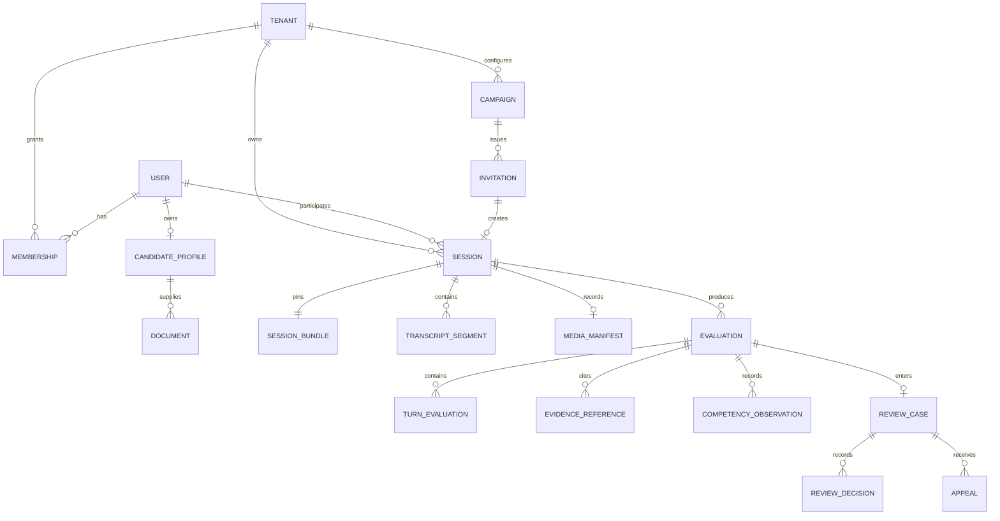

# Domain Model

**Status:** Proposed  
**Owner:** Go/domain architecture  
**Last updated:** 2026-08-23

## Bounded contexts

| Context | Aggregate roots | Owner |
|---|---|---|
| Identity | User, LoginSession, ServiceIdentity | Go identity |
| Tenancy | Tenant, Membership, RoleBinding, TenantPolicy | Go tenancy |
| Candidate | CandidateProfile, Document, Consent, Goal | Go candidate |
| Content | Artifact, Publication, Calibration | Go publication control; Python validates content |
| Interview | Invitation, Session, SessionBundle, Transcript | Go interview |
| Media | Upload, MediaManifest | Go media |
| Evaluation | Evaluation, TurnEvaluation, ArticulationResult, Observation | Go persistence; Python produces result |
| Recruiting | Campaign, ReviewCase, Decision, Appeal | Go recruiting |
| Progression | CompetencyHistory, ReadinessSnapshot | Go projection |
| Billing | Entitlement, UsageEntry, Quota | Go billing |
| Integration | Endpoint, DeliveryAttempt, Credential | Go integration |
| Audit | AuditEvent, PrivilegedGrant | Go audit |

## Relationships

## Aggregate invariants

### Tenant

- Policy changes affecting consent, retention, evaluation, or session behavior are versioned.
- Suspension blocks new work but does not abandon in-flight interviews.
- At least one authorized owner remains.

Key attributes include ID, name/slug, status, region, modes, entitlements, locale/timezone, retention/recording/disclosure policy references, quota plan, billing reference, and lifecycle timestamps.

### Membership and role binding

Membership connects one identity to a tenant. Role bindings attach capabilities and optional scopes such as campaign, role family, or region. Users cannot grant authority they lack. Revocation invalidates active tenant sessions promptly. Platform privilege is not modeled as an ordinary tenant membership.

### Candidate profile

- Candidate owns global practice profile and private evidence.
- Extracted facts retain source, confidence, extractor version, and correction history.
- Tenant screening references a candidate without absorbing private practice data.

Child records include documents, extracted facts, target roles, goals, accessibility preferences voluntarily stored, private evidence, and purpose-partitioned competency/articulation projections.

### Consent

- Append-only, purpose-specific, policy-versioned, localized, and withdrawable where applicable.
- Recording, screening, and optional research/model-improvement are distinct purposes.

Required attributes include subject, tenant/invitation/session where applicable, policy document/version, purpose, localized disclosure digest, affirmative action, timestamp, withdrawal/legal-basis state, and minimally necessary request context.

### Artifact

Types: persona, plan, rule pack, rubric, role standard, prompt, model policy, articulation policy.

Lifecycle: `draft → validating → approved → published → deprecated → retired`. Published artifacts are immutable and identified by reference, semantic/schema version, and digest.

### Invitation

Lifecycle: `draft → issued → delivered → opened → accepted → consumed`, with bounced, expired, and revoked branches. Tokens are hashed, high-entropy, single-purpose, and time-limited.

A campaign groups role, published configuration, reviewers, and invitations. Revoking an unused invitation does not silently terminate an already-started session.

### Session

Owns mode, candidate/tenant/invitation relationship, blueprint, pinned bundle, lifecycle version, consent/accommodation snapshot, event cursor, failure/recovery, and completion reason. Commands obey [session lifecycle](session-lifecycle.md).

All changes require expected version and idempotency. Visibility policy is stored separately from operational state so a completed screen does not accidentally inherit practice visibility.

### Session bundle

Immutable snapshot of tenant/mode policy, candidate/job context, persona, resolved plan, rules, rubric/calibration, role standard, readiness, prompts, models, experiments, versions, and digests. It cannot change after session start.

### Transcript

Append-only ordered segments with turn, speaker, timing, confidence, language, provider event, correction/supersession, and audio reference. Corrections do not destructively erase audit-relevant input.

### Media manifest

The database manifest, not bucket listing, is authoritative. It records tracks, keys, content types, sizes, checksums, timing/alignment, upload/finalization, encryption/region, retention, assessability, and deletion.

### Evaluation

Immutable after publication. Records input digests, pipeline/artifact/model versions, evidence, results, assessability, usage, attempts, and visibility. Governed re-evaluation creates a linked new result.

Turn evaluations, articulation results, evidence references, competency results, claims, contradictions, job-requirement evidence, and usage remain typed child records or validated immutable structures according to query and contract needs.

### Review case

Decisions are append-only. The current decision is a projection. Override requires reason; sensitive reads and changes are audited.

### Progression

Competency observations are append-only and evidence-linked. Readiness is reproducible against a pinned standard. Unknown is not zero; incomparable roles/rubrics are not averaged.

### Usage, integration, and audit

- Usage entries are immutable and identify tenant, session, capability, provider/model, unit, price version, and experiment.
- Integration endpoints own subscription, secret/key version, status, and delivery attempts with payload digest and safe response summary.
- Audit records true actor/service, authority, tenant, purpose, action, resource, outcome, correlation, and tamper evidence. Viewing privileged audit may itself be audited.

### Billing and quota

Entitlement governs available capabilities; quota tracks reserved and consumed units. Reconciliation uses immutable usage rather than counters alone. In-flight interview completion policy remains safe if quota is exhausted.

## Command ownership

Only the aggregate owner performs authoritative writes. Cross-context behavior uses application ports, durable workflows, events, or deliberately maintained read projections. API, persistence, and event structures do not replace domain models.

## Aggregate transaction boundaries

- A session transition and its outbox fact commit together.
- Publishing an evaluation and its evidence/progression facts commit consistently; projections may follow asynchronously.
- Review decision and audit/outbox records share a transaction boundary.
- Object bytes do not participate in database transactions; manifests use explicit pending/finalized states and reconciliation.
- Cross-aggregate processes such as deletion, composition, evaluation, notification, and integration delivery are durable workflows, not distributed transactions.

## Domain error conventions

Distinguish validation, forbidden, not found/existence-hidden, optimistic conflict, invalid state, expired, quota, retryable dependency, insufficient evidence, unassessable input, and integrity failure. Domain errors map to transport errors but do not contain HTTP or provider-specific behavior.

## Open decisions

- Candidate identity model for invitation-only participation.
- Campaign/role scoped reviewer authority.
- Calibration approval and separation of duties.
- Appeal aggregation and independent reviewer rules.
- Physical boundaries if a module later becomes a service.
