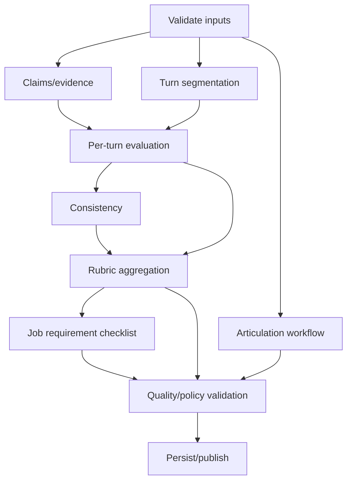

# Evaluation System

**Status:** Proposed  
**Owner:** Python intelligence and Go evaluation teams  
**Last updated:** 2026-08-23

## Purpose

Turn a pinned session bundle and sealed conversation into typed, evidence-linked practice feedback or screening evidence. The system does not predict job performance or make hiring decisions.

The provider-neutral model integration, rich rubric evolution, job-context
composition, validation boundary, rollout, and edge-case roadmap are specified
in [Model-Backed Evaluation, Rubric Composition, and Provider-Neutral Inference](model-backed-evaluation.md).

## Immutable inputs

Session/tenant/purpose, bundle digest, sealed transcript cursor/digest, media manifest/status, mode/disclosure policy, pipeline/model policy, idempotency key, and requested capabilities.

No stage resolves `latest` artifacts after session start.

## Pipeline



Activities record input digest, implementation/prompt/model version, attempt, usage, latency, and validation.

## Evidence

Types: supporting, contradictory, claim-unverified, gap, and delivery observation. Every material criterion cites evidence or explicitly states insufficient evidence. Unverified does not mean false; contradictions are neutral clarification signals.

## Turn evaluation

Assess responsiveness, competencies, specificity, decisions/ownership, reasoning/trade-offs, stated outcomes/metrics, gaps/vagueness, and strengths. Practice coaching may provide a fact-preserving structure; it remains empty when no useful improvement exists.

## Rubric aggregation

- Versioned competencies and calibrated anchors.
- Eligible evidence only.
- Coverage and evidence count per competency.
- Sufficiency threshold before scoring.
- Unknown/unassessed separated from poor.
- No averaging of incomparable roles/rubric versions.
- Qualitative band and optional numeric score only after validation.

Calibration publication creates a new immutable version. Re-evaluation creates a linked result with governed reason.

## Confidence

Confidence semantics are open. Until calibrated, use qualitative evidence sufficiency/consistency such as high, medium, low, and not assessable. Do not show statistical-looking intervals without a defensible calibrated meaning.

Always publish evidence count, plan/rubric coverage, transcript/audio warnings, contradictions, sufficiency, and reason codes.

## Job-description evidence

Use requirement-by-requirement `evidenced`, `partially_evidenced`, `not_discussed`, or `not_assessable`. Do not produce a headline match percentage.

## Output

Typed evaluation contains provenance, assessability, coverage, turn evaluations/evidence/coaching, competency results/anchors/sufficiency, contradictions, claims, job requirement checklist, optional articulation, usage/latency, publication, and visibility.

Free text supplements typed fields; it is never the only material representation.

```text
Evaluation
├── identity, purpose, mode and provenance
├── input/bundle/transcript/media digests
├── assessability and quality warnings
├── plan/rubric coverage
├── turn evaluations[]
│   ├── evidence[]
│   ├── strengths[]
│   ├── gaps[]
│   └── practice coaching?
├── competency results[]
│   ├── rubric anchor and level/score?
│   ├── sufficiency and evidence count
│   └── evidence[]
├── contradictions[]
├── claim verification[]
├── job requirement checklist[]
├── articulation results[]?
├── usage, cost units, latency and attempts
└── publication and visibility policy
```

## Publication checks

Input/version integrity, schema validity, resolving evidence references, numeric/threshold validity, no invented facts, mode visibility, required/degraded stages, usage reconciliation, and prompt-injection/unsafe-output controls.

Invalid results remain unpublished attempts. Optional articulation/coaching failure does not block valid core evaluation.

Publication is idempotent and records the exact validated attempt. Mode policy is rechecked at projection/response time so a screen result cannot be exposed through a practice DTO. Progression consumes only published candidate-practice observations under the correct purpose.

## Artifact governance

`draft → schema validation → offline evaluation → human review → approved → published → monitored → deprecated/retired`.

Publication evidence includes dataset, quality, latency, cost, fairness/accessibility review, approvers, and rollback.

## AI evaluation datasets

Cover disciplines/roles/seniority/shapes, strong/mixed/weak/insufficient evidence, concise/verbose equivalence, accents/speech differences/devices/noise, contradictions/claims, document/spoken prompt injection, accommodations, mode leakage, and articulation fact preservation.

Datasets have versioned manifests describing source/synthetic status, consent/legal basis, de-identification, splits, expected behavior, known limitations, access, retention, and owners. Synthetic examples are necessary for edge coverage but cannot be the only evidence for production validity.

## Metrics

Evidence precision/recall, human rubric agreement, insufficiency precision, unsupported-fact rate, contradiction false positives, schema validity, stability under irrelevant phrasing, quality disparity, latency, cost, override, and re-review.

Release reports segment by discipline, role shape, supported language/accent, audio quality, device, accommodation, artifact version, and provider/model policy where privacy permits. A regression budget and rollback/freeze owner are defined before publication.

## Human review and appeals

Suggested bands are evidence summaries, not decisions. The review UI exposes evidence/sufficiency before or alongside the suggestion under the approved anchoring policy. Decisions identify the reviewer and rationale; disagreement requires override reason. Re-review preserves original evidence/configuration and adds a new outcome rather than replacing history.

## Failures

Timeout: bounded retry. Invalid output: validate/repair/retry without silent coercion. Missing transcript: insufficient/failure by scope. Missing audio: content may continue; articulation degrades. Budget exhausted: preserve required result, mark optional omissions. Provider fallback only if equivalence is validated. Invalid evidence reference blocks publication.

## Open decisions

Confidence, evidence thresholds, historical re-evaluation, provider fallback equivalence, supported languages/accents, independent-review policy, and any employer-facing communication criterion.

Band semantics are settled by [ADR-0022](decisions/0022-band-is-a-rubric-anchored-judgement-under-deterministic-law.md): a band is a model's judgement against published anchors, and deterministic code validates it, may lower it to unassessed or reject it, and may never raise it. `aggregate-1`'s arithmetic derivation remains the implemented, labelled fallback. Confidence stays as [ADR-0015](decisions/0015-confidence-is-qualitative-evidence-sufficiency.md) defines it and is unaffected.
