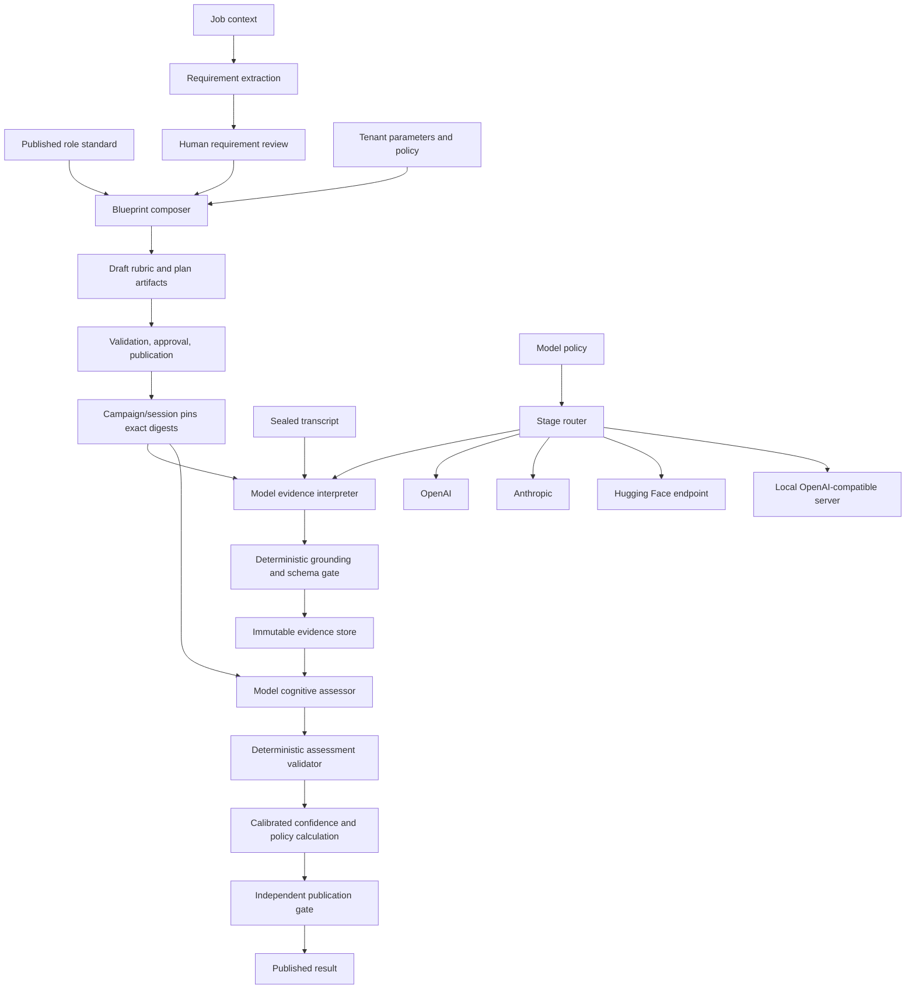

# Model-Backed Evaluation, Rubric Composition, and Provider-Neutral Inference

**Status:** Proposed target architecture and delivery roadmap  
**Owner:** Python intelligence, Go evaluation, content, recruiting, security, and AI quality teams  
**Last updated:** 2026-09-04  
**Related decisions:** [ADR-0011](decisions/0011-artifact-registry-review-publication-and-rollback.md), [ADR-0015](decisions/0015-confidence-is-qualitative-evidence-sufficiency.md), [ADR-0019](decisions/0019-model-providers-routing-and-budgets.md), [ADR-0020](decisions/0020-screening-disclosure-access-and-appeal.md), [ADR-0022](decisions/0022-band-is-a-rubric-anchored-judgement-under-deterministic-law.md)

## Executive summary

Prepeet's evaluation pipeline is deliberately model-free today. `evidence-1`
uses deterministic keyword and text-shape rules to extract transcript spans,
and `aggregate-1` applies a pinned rubric arithmetically. This floor is
reproducible, inexpensive, and useful for proving storage, provenance,
validation, retry, and publication behavior. It is not a production-quality
semantic evaluator: it cannot reliably understand synonyms, context,
seniority, the relevance of a metric, or whether an answer actually satisfies
a competency anchor.

The target is a provider-neutral, stage-routed hybrid evaluation system:

- a model may propose job requirements, competency links, evidence spans,
  contradiction candidates, rubric-relative observations, and optional
  coaching;
- deterministic code remains authoritative for input integrity, exact quote
  grounding, closed vocabularies, sufficiency, permissible outputs, result
  publication, and immutable provenance;
- OpenAI, Anthropic, Hugging Face endpoints, and local OpenAI-compatible
  servers are interchangeable behind one internal gateway;
- routing is per stage and pinned by policy, rather than selected globally by
  incidental deployment configuration;
- a deterministic floor remains available as an explicit, visible fallback;
- no model, prompt, rubric, routing, or fallback change reaches candidates
  without benchmark evidence, approval, monitoring, and rollback;
- job descriptions inform a reviewed role blueprint but never silently become
  evaluation policy.

This document distinguishes **Current** behavior from **Target** behavior.
Nothing marked Target should be described to users or operators as already
implemented.

## Scope

This proposal covers:

- model-backed evaluation of completed transcripts;
- model-assisted job-description and requirement extraction;
- richer, role-aware rubric composition and versioning;
- provider-neutral inference and local-model operation;
- structured model outputs and validation;
- per-stage routing, budgets, fallback, retries, and provenance;
- calibration, quality gates, fairness checks, monitoring, and rollback;
- migration from the deterministic floors;
- edge cases across practice and screening modes.

It does not change these standing boundaries:

- Prepeet evaluates recorded answers against written criteria; it does not
  predict job performance, personality, honesty, culture fit, or protected
  characteristics.
- A model's output is a proposal until deterministic validation accepts it.
- Employer-facing screening output supports a named human decision; it is not
  the hiring decision.
- There is no cross-competency compatibility percentage or overall candidate
  score.
- Unknown, not discussed, insufficient, and unassessable remain distinct from
  poor evidence.
- Published artifacts and published results are immutable.

## Current implementation: an honest inventory

### Evaluation

`evidence-1`:

- reads candidate turns only;
- splits text into sentences;
- links a sentence to a competency when it contains a sufficiently long token
  from the competency name;
- classifies uncertainty phrases as `gap`;
- classifies a matching sentence containing a number, or followed by a numeric
  outcome sentence, as `supporting`;
- otherwise classifies the match as `claim_unverified`;
- detects a narrow class of numeric contradictions;
- returns exact transcript quotes, character ranges, room-clock ranges, and an
  extraction version;
- makes no model or provider call.

Go validates every proposed span against the sealed input. It verifies that the
turn exists, the speaker is the candidate, the competency was in scope, the
quote is the exact transcript slice, and the time range is inside the turn.
Invalid evidence refuses the complete batch.

`aggregate-1`:

- counts supporting, contradictory, unverified, and gap spans per competency;
- applies the pinned rubric's supporting-evidence floor before assigning a
  band;
- derives a band from the supporting share of eligible evidence;
- derives qualitative confidence from pinned count rules;
- separates `NOT_DISCUSSED` from `INSUFFICIENT_EVIDENCE`;
- publishes no overall score;
- is a pure deterministic Go function.

### Current rubric

The shipped rubric contains generic sufficiency, band-ratio, and confidence
thresholds. It does not yet contain competency-specific criteria, behavioral
indicators, seniority expectations, anchor examples, weights, or explicit job
requirement mappings. Competency names currently come from the selected role
in the catalogue.

This distinction matters: the system currently has a versioned aggregation
policy called a rubric, but not yet the rich anchored rubric implied by the
long-term product language.

### Current job-description flow

A screening campaign stores the submitted job context verbatim. The
deterministic `requirements-rule-1` extractor treats non-heading lines as
requirements, records their exact source ranges, and lets a recruiter confirm,
correct, or reject them while the campaign is a draft. Opening the campaign
freezes the reviewed requirements.

`requirement-map-1` later links a requirement to a competency only when the
whole competency name appears in the requirement text. It reports each
requirement separately as `evidenced`, `partial`, `not_discussed`, or
`not_assessable`, with evidence identifiers and a suggested human follow-up.

The job description does **not** currently generate the competency set,
rubric, interview plan, anchors, thresholds, or questions.

### Current model support

The live interviewer already accepts a provider-neutral completion callable
and can use Anthropic, OpenAI, Hugging Face, or an OpenAI-compatible endpoint.
That abstraction applies to the interviewer. A model-backed evaluation
extractor, stage-aware model gateway, and per-stage router have not yet been
implemented.

### Current artifact lifecycle

The content registry already provides the essential governance substrate:

```text
draft -> validating -> approved -> published -> deprecated -> retired
```

Published versions cannot be edited. A change creates a new semantic version
and digest. Publication moves a current pointer for future compositions;
existing campaigns and sessions continue resolving their pinned digests.

The tenant rubric-library domain supports drafting, validation, approval,
publication, history, and in-use checks. A complete tenant-facing HTTP and web
authoring experience is not yet present. Platform artifacts are currently
authored in Git and loaded through `contentctl`.

## Design goals

1. **Semantic improvement without surrendering control.** Models understand
   meaning; deterministic code decides whether an output is admissible.
2. **No provider lock-in.** Product code depends on Prepeet contracts, never a
   provider SDK's request or response types.
3. **Reproducible history.** Every result identifies all inputs and algorithms
   needed to explain it later.
4. **Evidence before interpretation.** Every material conclusion resolves to
   candidate-authored transcript text.
5. **Job relevance with human governance.** Job context informs evaluation
   only through reviewed and published artifacts.
6. **Explicit degradation.** Fallbacks and omissions are visible in the result;
   a degraded result never impersonates the preferred route.
7. **Measured evolution.** Model and rubric changes are promoted by benchmark
   evidence, not preference or vendor claims.
8. **Local inference is first-class.** A self-hosted model must use the same
   contracts, gates, and telemetry as a cloud model.
9. **Practice and screening stay isolated.** Neither data nor policy crosses
   modes implicitly.
10. **Human review remains meaningful.** Reviewers see evidence and uncertainty,
    not a polished conclusion that hides how it was produced.

## Non-goals

- Free-form model scoring without typed evidence.
- Allowing a model to choose or modify the active rubric during evaluation.
- Automatically publishing a model-generated rubric.
- Treating the job description as objective truth.
- Hiding provider or fallback changes behind one undifferentiated model name.
- Comparing scores produced by different, uncalibrated rubric versions.
- Using chain-of-thought as an audit artifact. Store concise typed reasons, not
  hidden reasoning traces.
- Sending raw audio to a language model when the validated transcript is
  sufficient for the stage.
- Collecting demographic data merely because it could improve a dashboard.

## Target architecture



### Responsibility boundaries

| Component | Owns | Must not own |
|---|---|---|
| Content registry | Artifact versions, lifecycle, digests, current pointers | Evaluation results |
| Recruiting | Job context, reviewed requirements, campaign pins | Rubric parsing or provider selection |
| Interview | Session state, sealed transcript, bundle | Evaluation judgments |
| Intelligence | Model invocation and typed proposals | Authoritative product state |
| Evaluation | Evidence validation, aggregation, result publication | Provider SDK behavior |
| AI quality | Datasets, benchmarks, release reports, calibration | Runtime mutation of results |
| Operations | Secrets, endpoints, egress, capacity, alerts | Semantic rubric authorship |

### The model as a constrained cognitive assessor

The target model is not merely a smarter keyword finder. It is the semantic
reasoning component of the evaluation loop. After evidence grounding, it reads
the complete structured evidence record in the context of the pinned rubric,
role standard, interview plan, seniority, and reviewed job requirements. It
then proposes a coherent assessment of what the answer demonstrates.

Its responsibilities include:

- understanding paraphrases, domain language, indirect evidence, and context;
- reconstructing examples that span several turns without losing the exact
  evidence passages behind them;
- distinguishing claimed participation from demonstrated personal ownership;
- evaluating decisions, rationale, alternatives, trade-offs, execution,
  outcomes, learning, and limitations;
- distinguishing real experience, hypothetical reasoning, general knowledge,
  and interviewer-supplied information;
- assessing each rubric criterion against its written anchors;
- weighing supporting, limiting, ambiguous, and contradictory evidence
  together rather than merely counting it;
- resolving apparent contradictions when the transcript clearly describes a
  correction, different time period, different population, or different
  measurement;
- identifying the strongest supported anchor and explaining why higher and
  lower anchors do or do not fit;
- proposing a per-criterion finding and per-competency band;
- mapping the assessment to reviewed job requirements semantically;
- identifying what remains unknown and what follow-up would resolve it;
- synthesizing strengths, gaps, and practice coaching without inventing facts;
- emitting the measurable features used by the calibrated confidence layer.

The model therefore acts as the **brain**, while deterministic code acts as the
**constitution and evidence court**. Code does not try to reproduce semantic
judgment with arithmetic. It verifies that the judgment stayed within the
published rubric, is supported by valid evidence, obeys sufficiency and policy,
uses permitted outputs, and carries complete provenance.

The model is still not an autonomous product authority. It cannot change the
rubric, create facts, waive sufficiency, infer protected or prohibited traits,
publish results, or make the human hiring decision. "More intelligent" means
deeper rubric-bound reasoning, not broader permissions.

### Cognitive assessment output

The assessor should return a typed assessment for every criterion, including
criteria it could not assess:

```json
{
  "competency_id": "systems-design",
  "criterion_assessments": [
    {
      "criterion_id": "tradeoffs",
      "status": "demonstrated",
      "recommended_band": "strong",
      "supporting_evidence_ids": ["ev-17", "ev-18"],
      "limiting_evidence_ids": [],
      "assessment_basis": "Compared two viable designs against latency, cost, and operational constraints.",
      "higher_anchor_gap": "No higher anchor exists."
    },
    {
      "criterion_id": "failure-modes",
      "status": "partially_demonstrated",
      "recommended_band": "solid",
      "supporting_evidence_ids": ["ev-19"],
      "limiting_evidence_ids": ["ev-21"],
      "assessment_basis": "Named failover behavior but did not explain recovery testing.",
      "higher_anchor_gap": "Recovery verification was not evidenced."
    }
  ],
  "recommended_band": "solid",
  "band_basis": "Evidence meets the solid anchors across both required criteria; the strong failure-mode anchor is incomplete.",
  "unresolved_questions": [
    "How was regional failover tested before release?"
  ],
  "confidence_features": {
    "independent_examples": 1,
    "required_criteria_covered": 2,
    "required_criteria_total": 2,
    "unresolved_contradictions": 0,
    "ownership_clarity": "explicit"
  }
}
```

This is concise decision rationale, not private chain-of-thought. Every
material sentence must be derivable from referenced evidence and the pinned
rubric. The model may say that evidence is ambiguous; it may not fill the
ambiguity with an assumption.

## The rich rubric model

### Separate artifacts that should remain separate

One giant prompt-shaped artifact would be easy to create and impossible to
govern. Preserve distinct responsibilities:

- **Role standard:** durable professional expectations independent of one job.
- **Reviewed job requirements:** claims extracted from the employer's job
  context and corrected by a recruiter.
- **Rubric:** competencies, criteria, anchors, sufficiency, bands, and output
  constraints.
- **Interview plan:** topics, coverage priorities, question intents, timing,
  and follow-up policy.
- **Calibration:** benchmark set, human ratings, measured agreement, approved
  thresholds, and known limitations.
- **Model policy:** stage routes, allowed providers/models, budgets, retries,
  fallback rules, data-handling constraints, and timeouts.
- **Prompt:** provider-independent task instructions and structured-output
  contract version.
- **Persona:** presentation behavior for the interviewer, never scoring policy.

Each artifact is independently versioned and pinned. A material change to any
one creates a new version and a new evaluation report.

### Proposed rubric schema

The exact JSON schema should be contract-first and additive where possible.
The following illustrates the intended semantics rather than fixing the final
wire format:

```json
{
  "schema_version": "2.0",
  "role_standard": {
    "reference": "role-standard/backend-engineer",
    "version": "3.1.0",
    "digest": "sha256:..."
  },
  "scope": {
    "role_family": "software-engineering",
    "seniority": "senior",
    "modes": ["practice", "screening"],
    "languages": ["en-GB"]
  },
  "competencies": [
    {
      "id": "systems-design",
      "name": "Systems design",
      "description": "Designs reliable systems under explicit constraints.",
      "required": true,
      "priority": 1,
      "criteria": [
        {
          "id": "tradeoffs",
          "description": "Identifies and evaluates material trade-offs.",
          "allowed_evidence_kinds": ["supporting", "contradictory", "claim_unverified", "gap"],
          "anchors": [
            {
              "band": "developing",
              "description": "Names a design choice with limited rationale."
            },
            {
              "band": "solid",
              "description": "Compares credible alternatives against stated constraints."
            },
            {
              "band": "strong",
              "description": "Connects alternatives, constraints, failure modes, and measured outcomes."
            }
          ]
        }
      ],
      "sufficiency": {
        "min_independent_supporting_spans": 2,
        "min_criteria_covered": 1,
        "allow_single_extended_example": true
      }
    }
  ],
  "bands": [
    { "id": "developing", "order": 1 },
    { "id": "solid", "order": 2 },
    { "id": "strong", "order": 3 }
  ],
  "confidence": {
    "kind": "qualitative_evidence_sufficiency",
    "high": { "min_supporting": 4, "max_contradictory": 0 },
    "medium": { "min_supporting": 2, "max_contradictory": 1 }
  },
  "prohibited_inferences": [
    "personality",
    "honesty",
    "culture_fit",
    "protected_characteristic",
    "future_job_performance"
  ]
}
```

### Rubric formation and precedence

The job description should be one input to a proposed blueprint, not the
blueprint itself. Recommended precedence is:

1. Legal and responsible-evaluation policy: non-overridable constraints.
2. Published role standard: durable professional baseline.
3. Published rubric template: supported competency and anchor vocabulary.
4. Reviewed job requirements: employer-specific relevance.
5. Seniority, scope, jurisdiction, language, and accommodations.
6. Interview shape and available time: coverage feasibility.
7. Tenant additions: permitted only inside the supported schema and policy.

Conflicts must become review items. They must not be resolved silently by a
model. Examples:

- A job description requests a protected characteristic or a proxy for one:
  reject it from the rubric and require correction.
- A requirement conflicts with law, policy, or the role standard: flag it and
  block publication.
- The job contains more required competencies than the interview can cover:
  lengthen the plan, reduce scope explicitly, or mark requirements as outside
  this interview. Never proceed and later score the unasked competencies low.
- The job description uses inflated titles or contradictory seniority cues:
  require the author to select the intended level.
- A requirement cannot map to a supported competency: retain it as a reviewed
  requirement but mark it outside the interview's assessable scope.

### Human review of generated blueprints

A model may create a **draft** containing:

- proposed requirements and their exact job-context source spans;
- proposed competency links with short typed rationales;
- proposed criteria and anchors selected from an approved vocabulary;
- coverage and timing warnings;
- proposed plan topics and question intents;
- unsupported or ambiguous requirements requiring human resolution.

The author must be able to accept, correct, reject, and reorder proposals.
Every correction preserves the original proposal and provenance. Publication
requires validation and a different authorized person. The model can never be
the publisher.

## Provider-neutral model gateway

### Why the interviewer callable is not enough

The existing `(system_prompt, messages) -> text` callable is appropriate for a
single conversational stage. Evaluation needs structured output, capability
negotiation, per-stage routing, schema enforcement, budgets, provenance,
cancellation, and consistent error classification. Reusing raw chat calls in
each stage would couple business logic to provider quirks.

### Internal gateway contract

```python
class ModelGateway(Protocol):
    async def generate(self, request: ModelRequest) -> ModelResponse: ...

@dataclass(frozen=True)
class ModelRequest:
    stage: str
    request_id: str
    tenant_id: str
    purpose: str
    provider_route: str
    model: str
    prompt_version: str
    policy_version: str
    input_digest: str
    messages: tuple[Message, ...]
    response_schema: dict[str, object]
    timeout_seconds: float
    max_output_tokens: int
    data_classification: str

@dataclass(frozen=True)
class ModelResponse:
    structured_output: dict[str, object]
    provider: str
    model: str
    model_revision: str | None
    route_version: str
    latency_ms: int
    input_tokens: int | None
    output_tokens: int | None
    cost_units: int
    finish_reason: str
    provider_request_id: str | None
```

Business stages depend only on this interface. Provider adapters translate it
to Anthropic messages, OpenAI Responses/chat-compatible requests, Hugging Face
inference, or a local endpoint.

Do not expose provider response objects outside the adapter. Do not persist raw
provider errors, request bodies, secrets, or hidden reasoning.

### Provider capability descriptors

Providers differ materially. Each configured route should publish capabilities
that startup validation can inspect:

```text
structured_output: native | prompted | unsupported
json_schema_subset: identifier
streaming: true | false
cancellation: true | false
seed_control: supported | ignored | unsupported
model_revision: immutable | discoverable | opaque
max_context_tokens: integer
max_output_tokens: integer
regional_processing: verified region or unknown
zero_retention: verified | unverified
training_disabled: verified | unverified
```

A stage declares required capabilities. Routing refuses an incompatible route
before candidate data is sent. For example, a route with only best-effort JSON
may be allowed in development but not for screening evidence extraction unless
repair and failure rates have passed the release gate.

### Supported provider families

| Family | Adapter | Typical examples | Required configuration |
|---|---|---|---|
| OpenAI | Native OpenAI adapter | OpenAI hosted models | Model, key, approved organization/project and regional terms |
| Anthropic | Native Anthropic adapter | Claude hosted models | Model, key, approved account and regional terms |
| OpenAI-compatible | Compatible HTTP adapter | Ollama, vLLM, LM Studio, TGI, approved gateways | Model and base URL; key when required |
| Hugging Face | OpenAI-compatible or dedicated endpoint adapter | HF router, Inference Endpoints, TGI | Model/endpoint, base URL, key where required |

Model aliases such as `best` or `latest` are not sufficient provenance. Resolve
an alias to the most stable revision available and record both the configured
name and resolved revision. If a provider does not reveal an immutable
revision, record that limitation and treat a silent upstream model change as a
monitoring risk.

### Per-stage routing policy

Move from deployment-wide environment variables to a pinned policy artifact:

```yaml
schema_version: "2.0"
routes:
  interview-question:
    primary: anthropic-eu
    model: claude-approved-version
    timeout_seconds: 20
    max_output_tokens: 200
  evidence-extraction:
    primary: openai-eu
    model: approved-evidence-model
    fallback: evidence-1
    timeout_seconds: 45
    max_output_tokens: 6000
  requirement-extraction:
    primary: local-vllm
    model: approved-local-model
    fallback: requirements-rule-1
  coaching:
    primary: local-vllm
    model: approved-local-model
    fallback: coaching-1
budgets:
  evidence-extraction: 100
  requirement-extraction: 40
  coaching: 40
```

Secrets and concrete endpoint URLs remain deployment configuration referenced
by route name; they must not be embedded in artifacts. The artifact pins the
semantic route and constraints. Deployment configuration supplies credentials
and an approved endpoint matching that route.

### Local-model operation

Local models are first-class providers, not a development-only exception.
Common serving options include Ollama, vLLM, LM Studio, and TGI. They must expose
an approved adapter protocol, normally OpenAI-compatible HTTP.

Operational considerations:

- `localhost` inside a container refers to that container. A model running on
  the host may require `host.docker.internal` on Docker Desktop or an explicit
  host-gateway/network configuration on Linux.
- Production should not depend on an employee laptop. A "local" production
  route means a managed self-hosted inference service with capacity,
  redundancy, patching, and observability.
- Quantization can change evaluation quality. Record quantization, runtime,
  tokenizer, context length, sampling parameters, and model-weight digest as
  part of the route revision.
- CPU-only inference may exceed workflow timeouts. Benchmark the full
  transcript sizes and concurrency expected, not a short prompt.
- GPU exhaustion, model eviction, cold loading, and out-of-memory errors need
  typed failure codes and capacity alerts.
- A local endpoint still needs authentication, TLS or a private trusted
  network, request limits, and tenant isolation.
- Downloaded weights require license, provenance, integrity, and vulnerability
  review. "Available on Hugging Face" does not by itself permit commercial use.

## Model-backed evaluation pipeline

### Stage 1: resolve and verify inputs

The workflow resolves by digest:

- sealed transcript/evaluation input;
- rubric;
- role standard;
- interview plan;
- calibration;
- prompt;
- model policy;
- reviewed job requirements for screening;
- mode, disclosure, language, and relevant accommodation policy.

Every body is hash-verified. No stage resolves `latest` after the session has
started. Transcript text stays out of Temporal workflow history and travels by
scoped, expiring object reference.

### Stage 2: prepare bounded model input

The evaluator receives only what the stage needs:

- candidate turns and necessary interviewer question context;
- stable turn identifiers, character offsets, and timings;
- rubric competencies, criteria, and anchors;
- relevant reviewed requirements;
- explicit closed vocabularies and prohibited inferences;
- the response schema.

Do not include unrelated profile data, demographic information, recruiter
notes, earlier hiring decisions, or other candidates' data.

For a transcript beyond context limits, use deterministic turn boundaries and
rubric-aware batching. Overlap batches only enough to preserve adjacent context.
Merge by stable evidence identity and run contradiction detection across batch
boundaries. Never truncate silently.

### Stage 3: request typed evidence proposals

The model proposes observations, not final candidate judgments. A proposed
observation should contain:

```json
{
  "competency_id": "systems-design",
  "criterion_id": "tradeoffs",
  "kind": "supporting",
  "segment_sequence": 17,
  "char_start": 41,
  "char_end": 166,
  "quote": "...exact transcript text...",
  "anchor_relevance": "compares two options against latency and cost constraints",
  "requirement_ids": ["..."],
  "confidence_basis": "explicit_decision_and_outcome"
}
```

`anchor_relevance` is a bounded explanation for reviewer legibility. It is not
chain-of-thought and cannot substitute for the quoted evidence.

### Stage 4: deterministic validation

Validation must reject the complete model attempt when any material item is
invalid, unless the contract explicitly defines safe per-item rejection.

Required checks include:

- valid JSON against the exact response schema;
- known stage, schema, prompt, policy, and calculation versions;
- known competency, criterion, anchor, requirement, turn, and evidence kinds;
- candidate speaker only for candidate evidence;
- exact quote equality at `[char_start, char_end)`;
- character and time bounds inside the named turn;
- no overlapping duplicate observation presented as independent support;
- no evidence attributed to text that is only in an interviewer question;
- no cross-session, cross-candidate, cross-tenant, or cross-purpose identifiers;
- no forbidden inference fields or prohibited vocabulary;
- no band, score, confidence, or hiring recommendation in an extraction stage;
- no unsupported numeric fact in explanations;
- output size and count limits;
- no untrusted URL, tool instruction, or executable content carried forward.

One repair attempt may be allowed for purely syntactic failures if policy and
budget permit. Repair receives validation errors and the original bounded
input, not a broader data set. Grounding failures should normally fall back or
fail rather than ask the same model to rationalize invented evidence.

### Stage 5: normalize and store evidence

Accepted observations receive server-controlled identifiers and are stored
immutably. Replacement remains keyed by session and extraction version so a
retry converges rather than duplicates.

The extraction version should identify the implementation contract, while
provenance separately records:

- provider and endpoint route;
- configured model and resolved revision;
- prompt and response-schema versions;
- policy version;
- rubric and role-standard digests;
- input and output digests;
- sampling parameters where applicable;
- attempt, latency, tokens, cost units, and fallback state.

### Stage 6: perform cognitive rubric assessment

The mature target includes a second model stage after grounded evidence is
stored. The cognitive assessor receives evidence identifiers and bounded
transcript context, the pinned rich rubric and anchors, role standard,
interview-plan coverage, seniority, and reviewed job requirements. It produces:

- a finding for every rubric criterion;
- evidence for and evidence limiting each finding;
- a recommended criterion anchor/band;
- a synthesized competency band recommendation;
- the difference between the recommended band and the next anchor;
- semantic requirement findings;
- unresolved questions and missing evidence;
- bounded strengths, gaps, and practice coaching;
- structured confidence features, but not final confidence.

The assessor must consider the evidence as a whole. Four repetitions of one
vague claim must not outweigh one detailed counterexample. A metric matters
only when its subject, baseline, attribution, and relevance are understandable.
A team result does not demonstrate personal ownership without evidence of the
candidate's contribution. An answer can demonstrate strong reasoning without a
production outcome when the rubric explicitly permits hypothetical or case
reasoning.

### Stage 7: validate and finalize the assessment

Deterministic code validates rather than replaces the model's semantic work. It
enforces:

- every criterion in scope has exactly one permitted status;
- every cited evidence identifier exists and is eligible for that competency;
- the recommended band and criterion anchors exist in the pinned rubric;
- required criteria, sufficiency, and coverage rules cannot be waived;
- a band cannot be supported solely by interviewer text, duplicated evidence,
  invalid evidence, or an unassessable input;
- assessment explanations introduce no unsupported material facts;
- job requirement identifiers and mappings belong to the campaign;
- practice-only coaching cannot leak into screening decisions;
- prohibited inference and output rules hold;
- all route, model, prompt, rubric, and policy provenance is complete.

The validator can lower a recommendation to `unassessed` when an objective
sufficiency rule fails, or reject the attempt. It should not mechanically
promote or demote between valid semantic bands using evidence counts: doing so
would reintroduce a simplistic arithmetic evaluator after asking the model to
reason against anchors.

The final confidence label is calculated separately from validated features
using human-calibrated rules. A model's self-reported certainty is never the
confidence result.

### Staged introduction

The first production model release should still introduce semantic extraction
before cognitive band assessment. This isolates grounding quality and creates
the evidence corpus needed to benchmark the assessor. Once human benchmarks
show that rubric-relative model assessment materially improves agreement, the
cognitive stage becomes authoritative for band recommendations behind the
validator.

`aggregate-1` remains the explicit deterministic fallback. A result produced by
it is labeled as such and is never presented as equivalent to a model-assessed
result unless equivalence has been measured for that rubric boundary.

### Stage 8: independent publication gate

Publication re-reads stored evidence and pinned artifacts. It verifies:

- every result references stored admissible evidence;
- sufficiency and coverage recompute;
- criterion findings and bands are permitted by the rubric and evidence state;
- confidence is derived by the approved pinned method;
- warnings and omissions reflect actual stage outcomes;
- usage reconciles across attempts;
- model and policy provenance is complete;
- mode visibility permits the output;
- required stages completed;
- no prohibited aggregate or inference appears.

Invalid results remain unpublished and produce a typed visible failure.

## Prompt-injection and adversarial content

Transcripts, CVs, and job descriptions are untrusted data. A candidate or job
author may say "ignore the rubric," paste JSON, imitate system messages, include
tool-call syntax, or ask the evaluator to reveal secrets. The model prompt must
label these sources as quoted data, but prompt wording alone is not a control.

Structural controls:

- stages have no tools unless a separately approved capability requires one;
- model calls receive no credentials or secret-bearing environment content;
- output is accepted only through a strict schema;
- identifiers are validated against server-supplied allowlists;
- exact transcript grounding is mandatory;
- output URLs and instructions are inert strings and never executed;
- job-derived criteria require human review and publication;
- canary fixtures cover direct, indirect, multilingual, encoded, and
  role-play injection attempts;
- attempted injection is not treated as a character judgment about the person.

## Routing, retry, fallback, and budgets

### Failure taxonomy

Normalize provider-specific failures into stable internal codes:

| Class | Examples | Default handling |
|---|---|---|
| Invalid input | Missing transcript, digest mismatch, incoherent rubric | Terminal; fix source/configuration |
| Policy refusal | Route not approved for data class or region | Terminal for attempt; operator action |
| Authentication | Invalid/revoked key | Terminal until configuration changes |
| Rate limit | Provider quota or concurrency limit | Bounded retry if deadline permits |
| Provider unavailable | Network, 5xx, maintenance | Bounded retry, then approved fallback |
| Timeout | No response inside stage budget | Cancel, bounded retry/fallback |
| Context overflow | Input exceeds provider/model limit | Rebatch deterministically or refuse |
| Invalid structured output | Malformed or schema-invalid JSON | At most one bounded repair, then fallback |
| Ungrounded output | Quote/range/fact does not validate | Reject; normally no self-repair |
| Safety refusal | Provider declines valid evaluation content | Record distinctly; fallback only if approved |
| Budget exhausted | Stage has no units remaining | Required stage fails; optional stage omitted |
| Local capacity | OOM, model unloaded, GPU unavailable | Retry only when capacity signal supports it |

Provider messages are sanitized and length-bounded before logging or storage.

### Retry rules

- Retries must fit inside the workflow deadline and stage budget.
- Do not retry deterministic invalid input.
- Honor provider retry-after guidance within the deadline.
- Use idempotency keys when supported.
- Cancellation must propagate when a workflow or request ends.
- Record every attempt; only the accepted attempt contributes observations.
- A retry with different model parameters is a different route attempt and must
  be visible.

### Fallback rules

Fallback is not synonymous with "try every provider." A fallback route is
eligible only when:

- its provider terms are approved for the same data and region;
- its capability descriptor satisfies the stage;
- benchmark equivalence has been measured for the same rubric/task family;
- the pinned policy explicitly names it;
- remaining time and budget permit it.

The deterministic floor is a distinct fallback route. Results record
`fallback_used`, the failed preferred route, and the accepted route. Screening
policy may choose failure rather than a lower-quality fallback when equivalence
has not been demonstrated.

### Reproducibility language

Deterministic floors can be byte-reproducible. Hosted model calls usually
cannot guarantee bit-for-bit reproduction even with a seed. For model-backed
results, promise **audit reproducibility**, not exact regeneration:

- exact inputs and artifact digests are retained;
- provider, model revision where available, parameters, and output digest are
  recorded;
- the accepted raw structured response is retained under appropriate access
  and retention controls;
- the publication calculation can be replayed from stored accepted evidence;
- rerunning a model is a new attempt, never a rewrite of the old result.

## Provider and data governance

A cloud route is admissible only with approved records for:

- processing region;
- retention duration;
- training/data-use policy;
- data-processing agreement;
- subprocessors;
- security review;
- incident notification;
- deletion behavior;
- model/version change notification where available.

Network egress must enforce the approved host set. Configuration validation
alone cannot prove provider contractual behavior or physical processing
location.

Minimize every request. Use scoped service identities and expiring references.
Do not include names or contact details where pseudonymous identifiers suffice.
Apply the originating session's retention and legal-hold rules to model inputs,
accepted outputs, rejected attempts, and provider telemetry.

## Rubric editing and publication

### Platform-authored rubric

1. Author a new version in Git.
2. Validate schema and semantic coherence.
3. Run the complete evaluation harness against governed inputs.
4. Attach a dated report, named human approver, limitations, and executable
   rollback plan.
5. Publish through the registry lifecycle.
6. Move the current pointer only after publication succeeds.
7. Monitor by artifact and model route version.

### Tenant-authored rubric

1. Start from a published template or create a permitted draft.
2. Optionally generate a proposal from the role standard and reviewed job
   requirements.
3. Review every competency, criterion, anchor, exclusion, and coverage warning.
4. Validate against schema, policy, and interview-time feasibility.
5. Preview effects on an authorized historical/synthetic sample without
   modifying existing results.
6. Submit, approve, and publish with separation of duties.
7. New campaigns may select the new version; open campaigns remain unchanged.

The product must never offer "edit published rubric." The action is "create new
version." Retirement removes a version from future selection but never deletes
the historical body.

### Compatibility and versioning

- Patch: wording or metadata change proven not to change evaluation semantics.
- Minor: additive optional criterion or anchor within the same interpretation.
- Major: changed competency, threshold, band meaning, required evidence,
  prohibited inference, or output semantics.

Version labels do not replace digest identity. If bytes change, the digest must
change. A published `(reference, version)` cannot be reused with different
bytes.

Results under different major rubric versions are not directly comparable.
Historical re-evaluation, if ever permitted, creates a new linked result with a
governed reason; it never overwrites the original.

## Quality, calibration, and release gates

### Required datasets

The existing synthetic fixtures are necessary but insufficient. Add governed
sets covering:

- every supported profession, seniority, interview shape, and rubric family;
- strong, mixed, thin, contradictory, irrelevant, and silent evidence;
- concise and verbose answers conveying equivalent substance;
- synonyms, abbreviations, domain terminology, and indirect evidence;
- negation, hypotheticals, quoted speech, sarcasm, corrections, and changes over
  time;
- multiple metrics in one answer and identical numbers for different subjects;
- interrupted, partial, very short, and extremely long sessions;
- transcription errors, low confidence, missing timings, speaker mistakes, and
  duplicated segments;
- supported languages and code-switching;
- real accent, dialect, device, and audio-condition coverage collected with
  consent and governance rather than imitation;
- accommodations and alternative interaction modes;
- prompt injection and adversarial job descriptions;
- provider timeout, invalid JSON, truncation, refusal, and silent model-revision
  change;
- practice/screening leakage attempts;
- local-model quantization and runtime variants.

### Human benchmark program

Before claiming calibrated quality:

- define a rating handbook from the published rubric;
- use at least the approved number of independent qualified raters;
- blind raters to provider/model and unrelated candidate attributes;
- measure per-criterion and per-band agreement, not only a global average;
- retain disagreements and adjudication outcomes;
- stratify results by supported domain and input condition;
- predefine acceptance thresholds and escalation before observing results;
- record collection purpose, consent/lawful basis, access, retention, owner,
  and review date.

### Promotion gates

A route or artifact can progress through:

```text
development -> offline benchmark -> shadow -> limited practice -> limited screening -> general availability
```

Recommended gates:

- 100% exact grounding for accepted evidence;
- zero unsupported material facts in published output;
- 100% schema and publication-gate conformance;
- human agreement meeting a predefined threshold per supported domain;
- no unacceptable regression in insufficiency or contradiction false-positive
  rates;
- measured quality parity for every configured fallback;
- documented fairness and accessibility review;
- latency, throughput, timeout, and cost within stage budgets;
- named approver, known limitations, monitoring, and tested rollback.

Shadow results must never appear to candidates or recruiters and must obey the
same access and retention rules as production results.

## Observability and operations

### Metrics

Record by stage, provider route, model revision, prompt, rubric, mode, and
supported-domain boundary where cardinality permits:

- request, success, retry, fallback, refusal, and failure counts;
- latency and queue-time distributions;
- input/output tokens and cost units;
- structured-output and grounding rejection rates;
- evidence count, coverage, insufficiency, and contradiction rates;
- deterministic-versus-model disagreement in shadow runs;
- reviewer override and appeal rates;
- provider/model revision changes;
- local GPU utilization, memory, queue depth, load time, and eviction;
- quality-freeze and rollback state.

Never put transcript text, candidate identifiers, API keys, full prompts, or raw
provider errors in metric labels or ordinary logs.

### Tracing

One trace should connect the workflow activity, gateway route decision,
provider call, validation, storage, aggregation, and publication. Provider
request IDs may be recorded as protected trace attributes. Trace propagation
must not send tenant or candidate secrets to a provider.

### Alerts and automatic actions

Alert on:

- grounding or schema rejection above the approved baseline;
- abrupt evidence/insufficiency distribution shifts by artifact version;
- provider latency, rate limit, or failure-budget breach;
- fallback use above its expected rate;
- unannounced model revision change;
- cost-unit anomalies;
- local capacity saturation;
- cross-tenant/purpose validation attempts;
- reviewer override or appeal spikes.

Automatic rollback may move an artifact or route pointer only to a previously
approved version and must be audited. A quality freeze prevents further
promotion while leaving safe rollback available.

## Edge cases and required behavior

| Scenario | Required behavior |
|---|---|
| No candidate speech | Publish no invented evidence; mark all in-scope competencies not discussed or fail if the session input is invalid by policy |
| Competency never asked about | Unassessed/`NOT_DISCUSSED`, never a low band |
| Candidate admits no experience | Ground a `gap`; do not infer inability or dishonesty |
| Candidate uses a synonym | Model may link it with exact evidence and criterion; deterministic floor may miss it visibly |
| Number is irrelevant to competency | Do not count it as supporting merely because it is numeric |
| Candidate corrects an earlier number | Preserve both statements and identify the correction; do not automatically call it a contradiction |
| Same number describes different subjects | Do not merge or treat as corroboration |
| Hypothetical answer | Mark the evidence basis explicitly; do not represent it as completed experience |
| Team achievement with unclear ownership | Ground the claim and mark ownership specificity as unverified/thin; do not invent personal contribution |
| Interviewer supplies the answer | Do not attribute interviewer text to the candidate |
| Transcript has speaker-label uncertainty | Degrade affected evidence or require review; never guess the speaker for material evidence |
| Word timing missing | Character-ground text; mark audio/timing limitation and omit features that require timing |
| Transcript and audio disagree | Follow the governed transcript-correction process; do not let the evaluator silently rewrite either source |
| Duplicate transcript segment | Deduplicate by stable segment identity before counting independent evidence |
| Model repeats one quote as several observations | Merge or reject duplicates; one passage cannot inflate sufficiency |
| One quote supports multiple criteria | Permit explicit multi-linking, but count independence according to rubric rules |
| Very long transcript | Deterministically batch, report coverage, and detect cross-batch contradictions |
| Model context overflow | Rebatch or fail visibly; never silently omit the end of the interview |
| Malformed model JSON | One bounded syntactic repair when allowed, then fallback/failure |
| Valid JSON with fabricated quote | Reject the attempt; do not ask the model to justify it |
| Provider safety refusal | Record as refusal, not invalid candidate input; use only an approved fallback |
| Provider silently changes model | Detect where possible; freeze/alert and require re-evaluation evidence |
| Local model is offline | Typed provider-unavailable failure; bounded retry and approved fallback |
| Local model is too slow | Enforce timeout; do not extend candidate-visible workflows indefinitely |
| Local model produces weaker JSON | It must pass the same gate; local operation does not lower standards |
| Model route budget exhausted | Required stage fails; optional stage is omitted with a visible reason |
| Job description contains discriminatory criterion | Exclude and block publication pending authorized correction |
| Job description contains prompt injection | Treat it as source text; extract only grounded requirements and require review |
| Job requirement has no supported competency | Keep it visible as outside interview scope/`not_assessable` |
| Too many requirements for interview duration | Block opening or require explicit scope reduction; do not score uncovered requirements |
| Rubric changes after campaign opens | Existing campaign/session remains on its pinned digest |
| Model changes after session composition | Session uses the pinned route policy; an unavailable exact route follows explicit fallback/failure policy |
| Historical re-evaluation requested | Create a linked immutable result with reason and new provenance; preserve original |
| Practice data offered to screening | Refuse at the ownership/purpose boundary |
| Two tenants use the same reference | Resolve tenant override within scope; never leak the other tenant's body or result |
| Unsupported language | Refuse or mark unassessable according to published policy; do not silently translate and score |
| Code-switching in supported session | Use only a route benchmarked for it or mark affected scope unsupported |
| Candidate requests accommodation | Apply the pinned accommodation policy; do not treat changed interaction style as weaker evidence |
| Model explanation introduces new facts | Reject or remove the explanation; the underlying evidence alone may remain only under an explicitly safe per-item rule |
| Reviewer disagrees with model | Preserve original result, reviewer decision, reason, and provenance separately |
| Appeal is upheld | Add governed outcome/re-evaluation; never rewrite the original evidence trail |

## Delivery roadmap

### Phase 0: close specification gaps

- Approve the rich rubric and typed observation schemas.
- ~~Decide whether aggregation remains permanently deterministic or may later
  accept model-proposed per-anchor assessments.~~ Settled by
  [ADR-0022](decisions/0022-band-is-a-rubric-anchored-judgement-under-deterministic-law.md):
  the model judges against published anchors, deterministic code validates and
  may only lower or reject, and `aggregate-1` stays as the labelled fallback.
  Promotion is per release boundary on measured agreement, never a global
  switch.
- Define stage names and stable failure taxonomy.
- Decide raw model-response retention and access rules.
- Close supported language, regional processing, and screening legal decisions.
- Publish provider terms records required by ADR-0019.

**Exit:** approved contracts and threat model; no provider call required.

### Phase 1a: the rubric an evaluator can read

Phase 1 was originally one phase, and it was the longest pole with every
later phase behind it. Most of that length was authoring surface, which no
technical phase needs. The split is between what makes a rubric readable by
an evaluation stage and what makes it authorable by a tenant.

This half is authored the way platform artifacts are authored today — in
Git, loaded through `contentctl` — so no new user-facing surface gates any
model work.

- Add role standards, competency criteria, anchors, and feasibility rules to
  the rubric schema, contract-first.
- Implement rubric schema validation in the evaluation context.
- Add explicit reviewed requirement-to-competency mappings.
- Make campaign opening validate plan coverage against required rubric scope.

**Exit:** a rich rubric can be authored, validated, published and pinned,
and an evaluation stage can read an anchor. Phases 2, 3 and 4 depend on this
half and nothing more.

### Phase 1b: tenant self-service authoring

- Complete tenant rubric HTTP APIs and web authoring/version-history UI.
- Implement preview without mutating historical results.

**Exit:** a tenant administrator can create, review, publish, pin and roll
back a rich rubric without platform involvement. Required before a tenant
authors its own screening rubric in Phase 6. Required by no earlier phase,
and deliberately not allowed to hold one up.

### Phase 2: implement the model gateway

- Introduce the gateway protocol and normalized response/error types.
- Move existing interviewer adapters behind it without changing behavior.
- Add route registry, capability validation, cancellation, token/cost accounting,
  and sanitized telemetry.
- Support OpenAI, Anthropic, Hugging Face, and OpenAI-compatible local servers.
- Add route-level secrets and egress enforcement.

**Exit:** provider contract tests pass identically for every supported adapter.

### Phase 3: model-assisted job blueprint

**Requirement extraction becomes asynchronous, and the composition edge
lives in the worker.**

This is a product decision, not an implementation detail, and it has to be
made before the phase starts. Today `requirements-rule-1` runs
synchronously inside the API request that submits a job context: recruiting
holds no dependency on the intelligence plane, and only the worker holds a
gRPC client. Routing extraction to a model through the existing synchronous
path would do two things the product should refuse. It would make a
recruiter's submission wait on provider latency, and it would give the
campaign-creation flow a failure mode it does not have today — a provider
outage becoming an inability to record a job description.

So the flow changes shape rather than the boundary:

- Submitting a job context records the context and starts extraction. The
  requirement set carries a visible extraction status, so a recruiter reads
  "reading the job description" rather than an empty list that looks like a
  failure.
- Extraction runs in the worker, driven from the outbox, exactly as
  composition already runs. Recruiting keeps zero intelligence dependency;
  the worker composes recruiting and intelligence the way it already
  composes interview and intelligence.
- The path is asynchronous whichever extractor the route names. The
  deterministic floor finishes in milliseconds and the wait is
  imperceptible, but one control flow means switching routes is a policy
  change rather than a change of shape, and the deterministic path stays
  continuously exercised.
- One extractor runs per campaign, chosen by route, with
  `requirements-rule-1` as the fallback. Both do not run in production:
  two sources proposing overlapping requirements is a deduplication problem
  and a review burden for no benefit. Shadow comparison is a benchmarking
  mode with no user-visible output, as in Phase 4.

The remaining work:

- Replace `requirements-rule-1` optionally behind `RequirementExtractor`.
- Require exact source ranges and structured ambiguity flags.
- Generate only drafts; preserve recruiter correction and freeze behavior.
- Add adversarial and discriminatory job-context tests.
- Measure extraction quality against reviewed requirements.

**Exit:** approved tenants can opt into reviewed model-assisted requirement
extraction; the deterministic floor remains selectable; a provider outage
degrades extraction without blocking campaign creation.

### Phase 4: shadow model evidence extraction

**The sealed input does not change. The RPC carries the policy.**

The model stage needs the rubric, role standard, plan and reviewed
requirements, and today it can see none of them: the sealed evaluation
input is `{session_id, competencies, turns}`, where each competency is an
identifier and a name. There is no anchor in it to reason against.

The tempting fix is to widen that document, and it is the wrong one. The
sealed input is the conversation as evaluated. Its digest is recorded on
the seal as the evidence that these exact turns produced this result, and
five separate readers already depend on its shape: evidence extraction,
articulation, the practice coaching derivation, the recruiter review
screen, and the grace-expiry completion path. Widening it would be a
breaking change to an immutable record with five consumers, and it would
conflate two things that version independently — what the candidate said,
which is fixed forever, and which policy was applied to it, which is
revised deliberately.

The bundle already solves this. It pins every artifact by type, reference,
version, schema version and digest, which is exactly what CAT-02 built it
to do. So:

- Go resolves the rubric, role standard and plan **from the session
  bundle's own pins**, verifies each body against its pinned digest, and
  passes the verified bodies on the RPC.
- Reviewed job requirements come from recruiting, where they were frozen
  when the campaign opened, so reading them at evaluation time is safe by
  construction.
- The sealed input keeps its current shape and its current digest meaning.
  No stored document is rewritten and no reader changes.

This is a request-shape change to a gRPC contract, governed by the existing
codegen and compatibility gates, rather than a migration of immutable
stored state. Should a future stage genuinely require something the bundle
cannot pin and recruiting cannot supply, that is the point to write the
migration — with a new sealed-input schema version, both versions readable,
and every one of the five readers named in the plan.

- Implement structured model evidence extraction behind the existing Extractor
  boundary.
- Run it in shadow beside `evidence-1` with no user-visible output.
- Compare grounding, evidence recall/precision, contradictions, insufficiency,
  latency, and cost.
- Build the missing human benchmark and agreement program.

**Exit:** benchmark report, known limitations, approved route, and no publication
path from shadow output.

### Phase 5: limited practice release

- Enable the model extractor for opted-in practice traffic.
- Keep deterministic aggregation and publication validation.
- Record route and fallback visibly in result provenance.
- Monitor quality, feedback, rejection, latency, and cost.
- Exercise route and artifact rollback.

**Exit:** sustained practice quality and operational targets with no unresolved
high-severity safety or grounding failures.

### Phase 6: governed screening pilot

- Complete jurisdiction determinations and candidate disclosure.
- Require tenant rubric/calibration approval and measured fallback equivalence.
- Enable only approved role/rubric/language boundaries.
- Provide evidence-first recruiter review, override reasons, and appeals.
- Run fairness and assessability monitoring with an escalation owner.

**Exit:** pilot report and explicit approval. Practice success alone does not
authorize screening.

### Phase 7: controlled expansion

- Add providers/models only through the same gates.
- Add languages, professions, and local runtimes only with boundary-specific
  benchmarks.
- Promote cognitive anchor assessment only after extraction quality is stable
  and human evidence demonstrates that it improves rubric agreement.
- Revisit the deterministic floor and fallback policy without deleting either
  historical implementation or provenance.

## Testing strategy

### Unit and property tests

- canonical digest and version calculations;
- schema parsing and all semantic rubric invariants;
- exact quote/range/timing validation;
- duplicate and overlapping-evidence rules;
- aggregation determinism and order independence;
- route selection, budget accounting, and failure normalization;
- tenant, purpose, and artifact-scope isolation;
- requirement and competency mapping;
- serialization stability for authoritative deterministic records.

### Provider contract tests

Run the same adapter suite against fakes for every provider:

- successful structured output;
- streaming/non-streaming completion;
- timeout and cancellation;
- authentication and rate-limit errors;
- malformed/truncated response;
- safety refusal;
- context overflow;
- missing usage fields;
- opaque model revision;
- retry-after behavior;
- secret and error sanitization.

Optional live smoke tests use dedicated non-production accounts and synthetic
data. They do not run on forks with secrets.

### Integration tests

- sealed object -> model proposal -> Go validation -> storage -> aggregation ->
  publication;
- Temporal retry converges on one accepted evidence set and result;
- artifact publication after session composition cannot change its output;
- provider outage follows the exact pinned fallback policy;
- fallback result records both attempted and accepted routes;
- database triggers refuse result and artifact mutation;
- cross-language schema fixtures remain compatible;
- local container/host networking and TLS configuration work as documented.

### Evaluation tests

- human-rated extraction precision, recall, and anchor agreement;
- unsupported-fact and grounding rate;
- contradiction precision and false-positive taxonomy;
- insufficiency precision;
- irrelevant-phrasing and paraphrase stability;
- provider/model/fallback equivalence;
- subgroup and supported-boundary quality;
- latency, throughput, context-size, and cost distributions;
- reviewer override, re-review, and appeal outcomes.

## Rollout and rollback

Use flags scoped by mode, tenant, rubric, role family, language, and route. Do
not use candidate identity or protected characteristics as rollout selectors.

Rollback order:

1. Disable the affected model route for new attempts.
2. Move to an already approved equivalent route or deterministic floor.
3. If the artifact caused the regression, move its pointer to the approved
   prior version.
4. Preserve all affected results and attempts; do not rewrite history.
5. Identify sessions requiring human review or governed re-evaluation.
6. Declare a quality freeze when the cause or scope is uncertain.

Rollback must be rehearsed with synthetic traffic before release.

## Recommended implementation choices

1. Introduce the rich rubric before the evaluator model. A model cannot perform
   defensible rubric-relative evaluation when the rubric contains only generic
   count thresholds.
2. Put semantic intelligence in extraction first and keep aggregation
   deterministic for the initial model release. Then introduce a separately
   benchmarked cognitive assessor that proposes criterion and competency bands;
   do not mistake the migration sequence for the final intelligence boundary.
3. Use reviewed explicit requirement-to-competency links instead of relying on
   phrase matching once rich rubrics exist.
4. Maintain separate native Anthropic and OpenAI-compatible adapters, but one
   Prepeet gateway contract and error vocabulary.
5. Prefer JSON Schema structured outputs; still validate independently because
   provider-side schema enforcement is not a trust boundary.
6. Treat hosted model reproducibility as audit reproducibility, never promise
   byte-identical reruns.
7. Make local inference pass exactly the same quality and safety gates. Its
   privacy advantages do not prove semantic quality.
8. Do not launch model-backed screening before QUA-03 human calibration,
   QUA-05 fairness/assessability monitoring, and QUA-06 live quality rollback
   are complete for the released boundary.
9. Keep raw job context, transcript evidence, model proposals, aggregation, and
   human decisions as separate records. Separation is what makes correction and
   appeal possible.
10. Build the user-facing rubric authoring surface around "new version, preview,
    approve, publish," never a generic JSON editor or in-place edit.
11. Split the rubric work by who needs it. A rubric an evaluation stage can
    read is the prerequisite for every model phase and needs no authoring
    surface, because platform artifacts are authored in Git today. Tenant
    self-service is required only when a tenant authors its own rubric.
    Sequencing them together makes authoring UI the gate on model work it has
    no technical relationship to.
12. Reach the intelligence plane from the worker, never from a synchronous
    recruiter or candidate request. Composition already works this way. The
    rule it encodes: a provider outage may degrade a proposal, and may never
    prevent recording what a human submitted.
13. Resolve pinned policy from the bundle rather than widening the sealed
    input. The sealed input is the conversation as evaluated and has five
    readers; the bundle exists to pin artifacts by digest. Keeping the two
    apart is what lets a rubric be revised while a transcript stays fixed
    forever.

## Acceptance criteria for the improvement

The improvement is complete only when:

- [ ] A rich rubric expresses competency criteria, anchors, sufficiency, scope,
      prohibited inferences, and compatibility rules.
- [ ] Job context can propose reviewed requirements and explicit competency
      mappings without automatically changing evaluation policy.
- [ ] Tenant administrators can draft, validate, preview, approve, publish,
      inspect history, and roll back rubric versions through supported APIs and
      UI.
- [ ] The gateway runs the same evaluation stage through OpenAI, Anthropic,
      Hugging Face, and an OpenAI-compatible local server without business-code
      changes.
- [ ] Stage routing, model, prompt, policy, and fallback are pinned and recorded.
- [ ] Every accepted material claim resolves to exact candidate transcript text.
- [ ] The cognitive assessor evaluates every in-scope rubric criterion,
      synthesizes evidence across turns, recommends an anchored competency band,
      explains the gap to adjacent anchors, and states unresolved questions.
- [ ] Deterministic validation rejects fabricated, cross-scope, malformed, or
      prohibited output before storage/publication.
- [ ] Aggregation and publication remain independently verifiable.
- [ ] Human benchmarks calibrate thresholds and report agreement for every
      supported release boundary.
- [ ] Provider fallback equivalence is measured rather than assumed.
- [ ] Fairness, assessability, quality, latency, and cost monitoring are live
      with named escalation and tested rollback.
- [ ] Local models have recorded weight/runtime provenance, licensing,
      integrity, capacity, and security controls.
- [ ] Practice and screening releases are independently approved.
- [ ] Documentation and product copy state known limitations and never describe
      suggestions as predictions or decisions.

## Open decisions

The following require explicit owners before implementation crosses their
boundary:

- Final rubric v2 schema and compatibility rules.
- Whether one passage may satisfy multiple sufficiency units and under what
  independence rule.
- How criterion recommendations combine into a competency band, including
  required-criterion, conflicting-evidence, and boundary cases. Who decides
  the band is settled by
  [ADR-0022](decisions/0022-band-is-a-rubric-anchored-judgement-under-deterministic-law.md);
  what remains open is the combination rule the assessor reasons with and the
  validator checks against.
- Accepted raw model response retention and reviewer access.
- Required human benchmark size, expertise, and agreement thresholds by domain.
- Supported languages and code-switching policy.
- Screening behavior when only the deterministic fallback is available.
- Provider-specific approved regions and contractual records.
- Treatment of providers with opaque or silently changing model revisions.
- Local-model production ownership and GPU capacity model.
- Historical re-evaluation eligibility, authorization, and candidate notice.
- Whether rubric generation is available to all tenants or only managed
  calibration engagements initially.

Until these are resolved, the deterministic pipeline remains the authoritative
floor and model-backed evaluation remains a proposed improvement.
