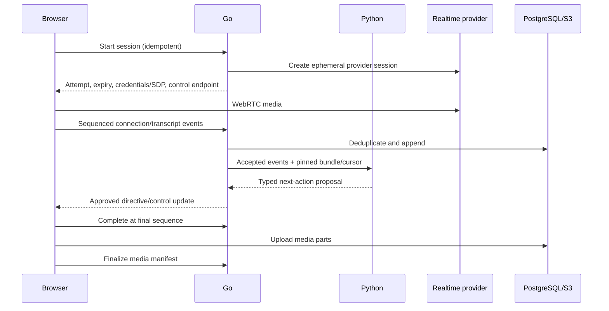

# Realtime Protocol

**Status:** Proposed  
**Owner:** Web, Go interview, and Python runtime teams  
**Last updated:** 2026-08-23

## Topology

The browser connects directly to the approved realtime provider over WebRTC. Go authorizes the attempt, validates control events, persists authoritative state, and approves Python action proposals. The backend does not proxy audio by default.



## Attempts and epochs

- A session may have multiple connection attempts but one authoritative conversation timeline.
- Each start/resume issues a monotonically increasing `connection_epoch`.
- Events from stale epochs are rejected after takeover.
- Only one active media publisher exists unless an explicit handoff is designed.
- Provider credentials are short-lived, session-bound, least-privileged, and not stored persistently in the browser.

## Event envelope

```json
{
  "schema_version": "1.0",
  "event_id": "evt_uuidv7",
  "session_id": "ses_uuidv7",
  "attempt_id": "attempt_uuidv7",
  "connection_epoch": 2,
  "sequence": 143,
  "occurred_at": "2026-08-23T12:34:56.789Z",
  "type": "transcript.segment.final",
  "payload": {},
  "trace_id": "..."
}
```

`event_id` deduplicates retries. `sequence` orders within an epoch. Go acknowledges the highest contiguous sequence and missing ranges. Final/corrected transcript and lifecycle events are durable; partial captions may be ephemeral.

## Event categories

Browser → Go: connection established/degraded/lost/resumed, device/microphone state, partial/final/corrected transcript, turn boundaries, interruption, caption/push-to-talk preference, complete/leave, media part/finalize.

Go → browser: state changed, acknowledgment/gap, directive, reconnect required, timing policy, completion accepted, upload authorization, processing stage, typed error.

Durability rules:

- partial transcript and transient input levels may be ephemeral;
- final/corrected transcript, lifecycle, attempt/epoch, completion, and media-manifest events are durable;
- corrections supersede earlier segments rather than erasing them;
- accepted sequence cursor is persisted often enough to recover without relying on browser memory;
- client may resend unacknowledged durable events, and Go must deduplicate.

## Python proposal

```json
{
  "proposal_id": "prop_uuidv7",
  "based_on_sequence": 143,
  "action": "ask_follow_up",
  "obligation_id": "obl_uuidv7",
  "question": "What measurable impact did that decision have?",
  "reason_code": "outcome_unverified",
  "policy_version": "runtime-policy-v1"
}
```

Go rejects stale, invalid, unknown-obligation, unauthorized, or lifecycle-incompatible proposals.

## Reconnection

1. Persist reconnecting state, deadline, epoch, cursor, and timing snapshot.
2. Browser retains a minimal ephemeral resend buffer.
3. Show/announce state, timer semantics, and safe exit.
4. Resume returns new epoch, accepted cursor, gaps, and credentials.
5. Resend missing durable events.
6. Rebuild intelligence state from snapshot plus events.
7. Resume without pretending missing speech was captured.

After grace expiry, finalize captured evidence with interruption/coverage warning. Refresh uses the same protocol. Competing-tab takeover invalidates the earlier epoch and is audited.

The browser displays connection state, retry count, timer semantics, and a safe exit. Status is conveyed through text and announced accessibly, not waveform/color alone. The interviewer acknowledges recovery without claiming missing content was heard.

## Media

Capture local and remote tracks separately when supported and consented. Upload resumable checksummed parts through scoped URLs. Finalize only after part/duration validation. Preserve alignment offsets. Playback uses short-lived authorization. Missing audio may degrade articulation but need not block content evaluation.

The manifest records object key, track, MIME/codec, size, checksum, duration, start offset, parts, region/encryption, consent/retention, and finalization status. Orphan/missing objects are reconciled. The browser does not choose arbitrary bucket keys.

## Browser responsibilities

- microphone permission, device selection, and preflight;
- WebRTC offer/answer and provider connection monitoring;
- optional consented local/remote capture;
- event sequence/resend buffer and connection epoch;
- accessible presentation of speaking, microphone, caption, timer, and connection state;
- resumable part upload and manifest-finalize request;
- no permanent provider secret or authoritative session state.

## Go responsibilities

- session/mode/consent/quota authorization;
- ephemeral provider authorization;
- lifecycle, event ordering, gap detection, deduplication, and persistence;
- transcript/media manifest authority;
- stale/invalid Python proposal rejection;
- user-visible progress and typed recovery status.

## Python responsibilities

- deterministic reduction of accepted interview events;
- coverage obligations, claims, repetition, and evidence state;
- typed next-action proposal using the pinned bundle;
- no product authorization, lifecycle transition, browser credential, or direct product write.

## Error model

Errors carry stable code, safe user message, retryability, affected component, correlation ID, and permitted recovery. Categories include authorization/policy, invalid state/version, expiry, device/media, network/provider, transcript gap, workflow stage, quota, and integrity validation.

Provider internals and secrets are never exposed. Retryable does not mean the client may repeat an unsafe command without the same idempotency key.

## Proposed budgets

| Operation | Target |
|---|---|
| Start authorization excluding provider | p95 < 500 ms |
| Provider credential/session setup | p95 < 2 s |
| Browser start to usable connection | p95 < 5 s |
| Event acknowledgment | p95 < 250 ms |
| Post-turn proposal | p95 < 1.5 s with fallback |
| Resume authorization | p95 < 2 s |

## Test matrix

Duplicates, reordering, gaps, correction, device loss, mobile network switch, refresh, competing tab, stale proposal, credential expiry, provider outage, worker restart, partial transcript/media, and screen-mode leakage.

Also test disconnect during every lifecycle transition, timer pause/resume, old epoch injection, duplicate completion, late transcript after seal, upload checksum mismatch, session expiry, quota exhaustion after start, reduced motion, keyboard push-to-talk, and screen-reader announcements.
