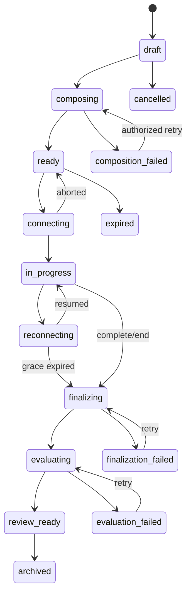

# Session Lifecycle

**Status:** Proposed  
**Owner:** Go interview module  
**Last updated:** 2026-08-23

## State machine

Candidate/recruiter visibility is a policy projection, not a lifecycle state.

## Transition contract

| Transition | Preconditions | Durable effects |
|---|---|---|
| Create | Authorized actor, mode allowed | Session, tenant/candidate scope, blueprint revision |
| Compose | Valid inputs and prerequisites | Temporal workflow with session ID workflow identity |
| Ready | Valid bundle persisted | Bundle digest and versions |
| Start | Ready, unexpired, authorized, quota reserved | Attempt and short-lived realtime authorization |
| In progress | Provider connection accepted | Start time and active connection epoch |
| Reconnecting | Expected connection lost | Deadline, cursor, timer snapshot |
| Finalize | Complete/end/recovery policy | Seal final conversational cursor |
| Evaluate | Transcript sealed, media status known | Immutable evaluation request/digests |
| Review ready | Valid result and policy checks | Publish projection and outbox notification |
| Archive | Retention permits | Archive metadata and object lifecycle work |

Exceptional terminal states include cancelled, expired, composition failed, interrupted, finalization failed, and evaluation failed. Retryable failures should remain visible workflow state rather than destructive lifecycle rewrites.

## Command requirements

Every mutation carries tenant, actor/service, purpose, idempotency key, expected aggregate version, and correlation ID. Each transition defines authorized actors, preconditions, emitted events, timeout, retry, compensation, visibility, and audit.

## Timing

Proposed rules:

- duration counts active interview time;
- connecting and reconnecting do not count against the candidate;
- finalization/evaluation do not count;
- response latency is not used in screening or articulation scoring;
- accommodations may change pacing without changing evaluation anchors.

Reconnect grace and maximum duration are versioned policies, not UI constants.

## Completion

Completion is idempotent:

1. Accept final cursor and reject later conversational events.
2. Reconcile or record sequence gaps.
3. Seal transcript.
4. Await media finalization for a bounded period.
5. Continue without optional media with explicit warnings.
6. Persist evaluation input digests.
7. Run evaluation.
8. Publish only after validation and mode-visibility checks.

## Mode differences

Practice may expose results, coaching, redo, and progression. Screen exposes confirmation to candidate and review to authorized tenant users under approved disclosure policy. Screen retry/re-invitation after interruption is a human-governed incident/accommodation decision.

## Required tests

- duplicate and conflicting commands;
- invalid transitions and stale versions;
- cancellation/expiry during composition/start;
- disconnect in every live state;
- final cursor gaps and late events;
- worker restart and workflow replay;
- quota change after start;
- practice/screen visibility attempts;
- retry without duplicate evaluation, usage, or notification.

