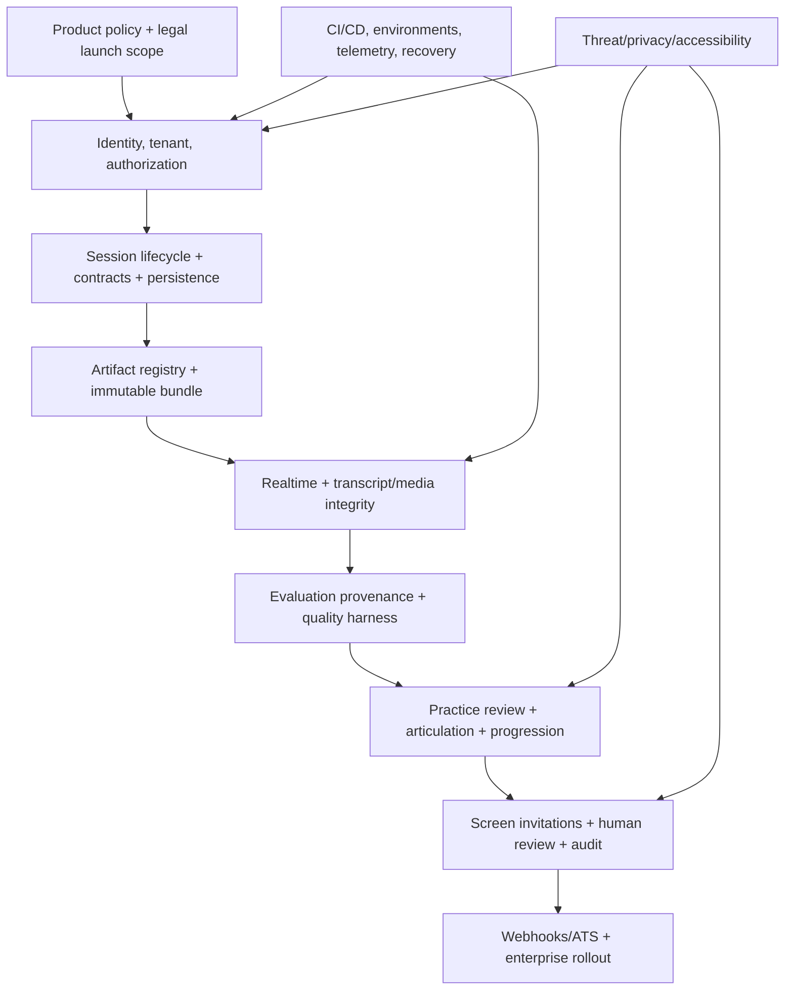

# Dependency Map

**Status:** Proposed  
**Owner:** Principal Engineer and delivery leads  
**Last updated:** 2026-08-23

## Critical path

## Work package dependencies

| Work package | Requires | Unlocks |
|---|---|---|
| Contract/codegen foundation | Language/repo standards | Web/Go/Python parallel implementation |
| Tenant/auth context | Identity ADR, DB/RLS | Every protected capability |
| Artifact registry | Schema/governance ADR | Bundle composition and reproducibility |
| Session aggregate | Domain/state contracts | Realtime and workflow orchestration |
| Temporal foundation | Hosting/ownership ADR | Composition, evaluation, deletion, delivery |
| Realtime browser | Provider/media ADR, session start | Live walking skeleton |
| Transcript/media integrity | Protocol/storage | Evaluation and articulation |
| Evaluation harness | Artifacts, datasets, evidence schema | Trustworthy results |
| Practice review | Evaluation contracts | User value validation |
| Progression | Published practice observations/standards | Readiness and targeted practice |
| Screening | Legal policy, scoped auth, audit, evaluation quality | Enterprise pilot |
| Webhooks | Events, secrets, SSRF/signing controls | ATS integration |

## Parallel tracks

Design-system implementation and user research can progress with foundation. AI dataset authoring starts before runtime completion using synthetic/governed fixtures. Threat modeling, accessibility test planning, telemetry conventions, and cost model begin in Phase 0. Screening legal work begins early but feature development waits for critical decisions.

## Decision blockers

Screen disclosure/appeals, confidence semantics, supported languages/accents, reconnect/retry policy, retention/legal hold, provider/region, identity, Temporal, and billing/quota.

Each blocker requires owner, target date, fallback scope, and affected milestone in the delivery tracker.

## Extraction dependencies

Do not split services until module APIs, telemetry, load/cost evidence, ownership, and data migration/consistency strategy exist. Extraction must not precede a stable in-process boundary.

