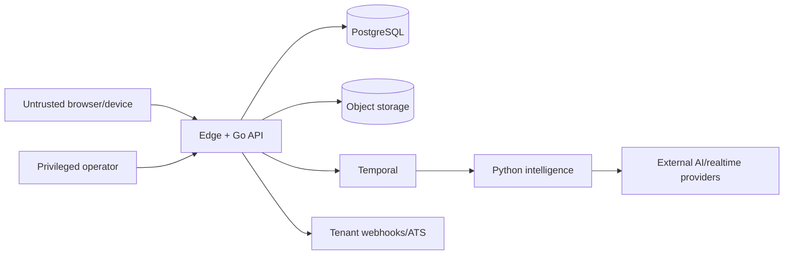

# Threat Model

**Status:** Initial model; update per capability/provider  
**Owner:** Security  
**Last updated:** 2026-08-23

## Security objectives

Preserve tenant isolation, candidate privacy/dignity, interview/evaluation integrity, service availability, and accountable human hiring decisions.

## Trust boundaries

## Primary threats and controls

| Threat | Controls |
|---|---|
| Cross-tenant IDOR/list leakage | Go resource policy, repository tenant predicates, RLS, adversarial list/batch tests |
| Practice data leaking to employer | Separate purpose/ownership projections, explicit authorization, mode tests |
| Invitation theft/replay/enumeration | High-entropy hashed token, expiry, single purpose/use, rate limits, no URL logging |
| Account takeover | MFA/step-up, secure sessions, refresh rotation/reuse detection, revocation |
| Malicious CV/JD/spoken prompt injection | Treat content as data, trusted/untrusted prompt separation, allow-listed tools, Go reauthorization |
| Model output changes state | Typed schema and Go validation; no direct product write authority |
| Audio/document URL leakage | Private buckets, opaque keys, short-lived scoped URLs, sensitive-read audit |
| Transcript/event tampering | Checksums/digests, event IDs/sequences/epochs, append-only corrections |
| Webhook forgery/replay/SSRF | Signing/timestamp/dedup, destination validation, restricted egress/redirects |
| Privileged support abuse | Purpose/ticket/elevation/expiry, audit of reads/actions, alerts/access review |
| PII in telemetry/datasets | Content prohibition, filtering/scanning, governed debug access and datasets |
| Artifact/prompt supply-chain attack | Review/approval, schema/evals, immutable publication, digests, rollback/freeze |
| Cost/availability abuse | Per-subject/tenant quotas, concurrency/duration/upload/model budgets, WAF/rate limits |
| Unfair result from bad media/transcription | Assessability, quality warnings, accommodations, supported matrix, insufficiency |

## Security requirements

- MFA/step-up for privileged actions.
- Workload identity and short-lived service credentials.
- Encryption in transit/at rest and managed key rotation.
- Parameterized/generated SQL and bounded validated uploads with malware scanning.
- CSP, CSRF defense, safe redirects, frame protection, dependency/image scanning.
- Tamper-evident privileged/consequential audit.
- Ephemeral session-bound realtime credentials.
- External provider retention, training, region, and subprocessors governed.

## Abuse cases to test

- Change tenant/resource IDs in reads, lists, exports, SSE, WebSocket, and object URLs.
- Use screen invitation to reach practice results or another candidate.
- Replay consumed invitation, webhook, browser event, completion, and decision.
- Inject instructions into CV/JD/transcript asking the model to disclose or act.
- Submit stale runtime proposal or stale connection epoch.
- Exfiltrate through logs, model error, webhook, export, or support tool.
- Exhaust audio upload, realtime connection, evaluation, or retry budget.

## Incident-sensitive capabilities

Cross-tenant exposure, leaked media, key compromise, malicious artifact, provider-policy breach, webhook leak, evaluation-integrity regression, accessibility/accommodation failure, transcription disparity, and unauthorized privileged access require dedicated runbooks and impact queries.

## Review cadence

Review before practice launch, screen launch, every new provider/integration, privileged feature, new data purpose, regional expansion, and material architecture change.

