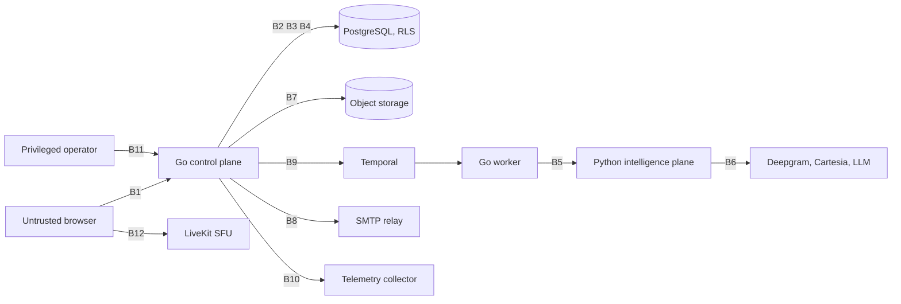

# Threat Model

**Status:** Maintained, and honest about what is unproven
**Owner:** Security, with a named owner per trust boundary below
**Last updated:** 2026-08-31
**Last reviewed against the code:** 2026-08-31, migrations 0001 to 0047

## Why this document is shaped this way

A threat model that lists categories is a checklist, and a checklist cannot be wrong, which is what
makes it useless. Every entry here names the code, migration or test that mitigates the threat today,
or says plainly that nothing does. Where a control exists but nothing has attacked it, the entry says
that too, because a control nobody has tried to break is a belief rather than a finding.

The exposures this product actually has are specific to it: a candidate's practice history reaching an
employer, one tenant reading another's campaigns or evaluations, a recruiter reading a campaign they
are not on, candidate speech leaving to third-party model providers, a sign-in link crossing an
unencrypted relay, and evaluation evidence changing after a hiring decision has cited it. Those are
traced below against the code that exists, not against the architecture that is written down.

## Security objectives

Preserve tenant isolation, the separation of practice from screening, candidate privacy and dignity,
evaluation integrity, service availability, and accountable human hiring decisions.

## How to read an entry

Two things are recorded separately, because conflating them is how a document overstates its own
assurance.

**Control state**, what the code does:

| State | Meaning |
|---|---|
| Enforced | The code refuses the thing. A named file, migration or trigger does it. |
| Enforced in part | Some paths refuse it, others do not, and the entry says which. |
| Declared undefended | The absence is deliberate, written down, with a reason and a gate that stops it spreading. |
| Specified only | A document requires it. No code implements it. |
| Not built | The feature the threat applies to does not exist yet. |

**Assurance state**, what has been tried against it:

| State | Meaning |
|---|---|
| Attacked | A test deliberately attempts the thing, against a target known to exist, with a control case that succeeds. |
| Asserted | A test proves the happy path or the structure, but nothing tries to break it. |
| Unattacked | Nothing has tried. |

No entry anywhere in this document is Attacked by an independent party. See "What has actually been
attacked" below.

## What has actually been attacked

SEC-02's suite is real evidence and is cited rather than restated. Its scope is written in
[19-security-and-privacy.md](../delivery/tickets/19-security-and-privacy.md), and the important half
is what it does not reach.

`services/platform/internal/isolation` attacks three layers: the HTTP handler, the bounded context and
the database, for member administration and tenant selection only. Each attack names a row that exists
under the other tenant at that moment, is otherwise valid, and is paired with a control that succeeds.
Its structural gate in `registry_test.go` puts every table the migrations create into one of three
states, and a tenant-scoped table added without row-level security breaks the build without Docker.

It does not attack object storage, Temporal workflows, caches, analytics, telemetry, exports, webhooks
or signed URLs. It attacks two request paths out of the whole API, so the interview, evaluation,
billing, candidate, content, progression and recruiting contexts have their tables checked structurally
and no request-level attack of their own.

Two other suites carry real adversarial weight.
`services/platform/platform/database/practice_isolation_integration_test.go` attacks the practice and
screening separation at the database, through every context shape a tenant-side path could plausibly
run with, and proves its own detector against a planted offender before running it against the real
schema. `services/platform/platform/authz/authz_test.go` runs every owner capability against a
deliberately over-provisioned tenant subject.

**Nobody but the author has run any of it.** SEC-09 commissions an independent tester and has not been
started. Until it has, every "Attacked" state in this document means "attacked by the person who wrote
the control", which is the weakest form of the claim.

## Trust boundaries

| Boundary | Owner | Control set today |
|---|---|---|
| B0 Browser to Next.js | Web | Renders and calls B1 on the person's behalf. Holds no database or intelligence authority of its own, per `authorization-model.md`, so it adds no boundary of its own and must never become one |
| B1 Browser to Go API | Identity and Go platform | Session cookie lookup, capability decision in `platform/authz`, per-address and per-network rate limiting on every guessable endpoint, `HttpOnly` and `SameSite=Lax` cookies in `internal/api/cookie.go` |
| B2 Between tenants | Go platform and data | `SET LOCAL app.tenant_id` per transaction, forced RLS on every tenant table, an application role with neither SUPERUSER nor BYPASSRLS, the structural gate in `internal/isolation/registry_test.go` |
| B3 Practice to employer | Identity and candidate | Owner-scoped RLS with a required tenant-context absence, a stop-ship tripwire trigger, the structural rule that no candidate table may grow a `tenant_id` |
| B4 Between campaigns in one tenant | Recruiting | The join in `CampaignsForRecruiter`. Not the database: see T4 |
| B5 Control plane to intelligence plane | Go platform and intelligence | mTLS, refused at startup outside local and preview |
| B6 Intelligence plane to model providers | Intelligence and legal | Provenance recording only: see T6 |
| B7 Object storage | Go platform | Derived keys, presign TTL clamped to 15 minutes, one shared workload identity |
| B8 Outbound email | Go platform | STARTTLS required, plaintext refused unless the environment declares it |
| B9 Temporal | Go platform | A data converter that refuses oversized or restricted payloads on encode |
| B10 Telemetry | Go platform and operations | Attribute-key allowlist, scrubber over every value, refusal path for callers that must not carry the content |
| B11 Privileged operator | Security | Time-bound elevation with reason and ticket, one audit row per request made under a grant |
| B12 Browser to LiveKit | Realtime | One room, one identity, a join window of at most ten minutes |
| B13 Platform to a tenant webhook or ATS | Integrations | None. The dispatcher routes in process and makes no outbound request, so this boundary is specified and not yet crossed: see T16 |

## Threats

### T1 A candidate's practice history reaches an employer

The product's defining promise, and the one whose failure is a stop-ship condition in
[responsible-hiring.md](responsible-hiring.md).

**Enforced. Attacked.** Every table in the `candidate` schema forces row-level security with an
owner-scoped policy, and the policy requires tenant context to be *absent*, not merely different. That
clause exists because the profiles table leaked without it: the owner's own identity, reached through a
code path that had also set tenant context, satisfied an owner policy that said nothing about tenants.
`TestEveryCandidateTableIsOwnerScopedAndTenantFree` fails the build if a candidate table grows a
`tenant_id`, has no owner policy, or consults tenant context as an authority rather than as a required
absence, and it reads the catalog rather than a list of tables, so the rule binds tables that do not
exist yet.

`TestTenantAuthorityReadsNoPracticeRows` runs five context shapes, tenant alone, the recruiter's user
id, both together, tenant plus the owner's own id, and no context at all, and each must see zero rows.
`TestTheTripwireCatchesWhatThePolicyCannot` covers the one shape row-level security cannot: the owner
writing their own row inside a transaction that also carries tenant context. That write is refused by a
trigger whose message says "stop-ship", and the test asserts the wording, because the alarm is the
point.

`TestNoViewJoinsPracticeDataToTenantData` forbids any view or materialized view joining a candidate
table to a table carrying `tenant_id`, and proves the detector against a planted offender first.

**What is not covered.** No projection exists yet, so the rule guards a shape rather than a system.
Object storage keeps practice media under `candidate/<id>/...` and screening media under
`tenant/<id>/...`, which is derivation rather than enforcement: see T7.

### T2 One tenant reads another's data

**Enforced. Attacked, but only along two request paths.**

The database half is the strong half. Tenant context is set with `SET LOCAL` so it dies with the
transaction rather than being inherited by the next request on a pooled connection, and
`TestTenantContextDoesNotSurviveTheTransaction` proves it. Both `SetTenant` and `SetUser` refuse an
empty value, so a path that forgets to scope itself fails closed rather than open. The application role
is asserted to hold neither SUPERUSER nor BYPASSRLS, without which every other test here is decorative.

`internal/isolation/registry_test.go` is the maintenance mechanism, and it is worth more than any
single attack. Every table is defended, declared unconditional, or declared undefended with a reason,
the declarations are capped at twelve and one, and a table carrying `tenant_id` can only be declared
away through a field that says so in the open. Exactly one table uses it, `integration.outbox`, whose
dispatcher acts for no tenant. That exercise found a hole in the gate itself: a table stayed green with
its tenant policy replaced by `USING (true)`, because other policies on it still named the caller and
PostgreSQL ORs permissive policies together. The rule now demands that every policy be keyed.

**Where it is thin.** Only member administration and tenant selection are attacked at the handler and
context layers. Campaigns, disclosures, evaluations, sessions, billing and content have their tables
checked structurally and no request-level attack. `identity` tables carry no row-level security by
design, declared rather than defended: what protects them is the query predicate and the policy layer,
and nothing in the isolation suite covers them.

### T3 A recruiter reads a candidate's screening evidence without scope

**Specified only for the read path. Not built.** No screening evidence endpoint exists.
`evaluation.read_screen` and `evaluation.review` are catalogue entries with no call site.

### T4 A recruiter on one campaign reads another campaign

**Enforced in part. Unattacked. This is an open risk: see R1.**

`Store.CampaignForRecruiter` in `services/platform/internal/recruiting/store.go` reads a campaign only
through `CampaignsForRecruiter`, which scopes by joining `recruiting.campaign_recruiter` rather than by
a filter the caller supplies, so a caller that forgets to filter gets nothing rather than everything.
The access check and the read are one query, deliberately, because two steps is where the check gets
skipped.

But the row-level security policy on `recruiting.campaign` is `campaign_tenant`, keyed to the tenant
alone. Migration 0043 says the per-campaign scope is "the database's rather than a handler's", and for
the `campaign_recruiter` table that is true. For the `campaign` table it is not: any future query that
reads `recruiting.campaign` under tenant scope without the join sees every campaign in the tenant. The
second line of defence that T2 has does not exist here, and `authz.ScopeCampaign` is defined in
`platform/authz/catalogue.go` and consulted by no production code at all.

### T5 A sign-in link or one-time code crosses an unencrypted relay

**Enforced. Asserted.** `platform/email` upgrades with STARTTLS whenever the relay offers it, with
certificate verification on, `ServerName` set, and TLS 1.2 as the floor. A failed upgrade is fatal.
When the relay offers no STARTTLS the send is refused, because the body carries a sign-in link often
enough that this is a credential leak rather than a privacy preference, and it is refused regardless
once a relay password would go with it. `PREPEET_SMTP_ALLOW_PLAINTEXT` declares a trusted local relay,
and `platform/config` turns it on automatically only in the local and preview environments; staging and
production refuse the send.

**Residual.** An active attacker can strip the STARTTLS capability from the relay's greeting, and the
code has no memory of having expected encryption before, so it will refuse rather than downgrade. That
is the correct failure, but it is a denial of service on password recovery, which is worth knowing
before an incident. Separately, an email that has been enqueued and not yet sent holds the plaintext
link in `notification.emails.body`; the body is nulled on send, so a stalled or dead-lettered queue is
the exposure window. That table is declared undefended in the isolation registry, correctly, since it
is keyed by recipient address rather than by tenant.

### T6 Candidate audio and transcripts leave to third-party model providers

**Provenance is enforced. The provider terms are not. Unattacked. This is the largest open risk: see
R2.**

The live voice loop is the only third-party egress in the product. Raw candidate audio frames go to
Deepgram, interviewer text goes to Cartesia, and the candidate's transcribed speech goes to the
configured LLM cumulatively, the whole accumulated history on every turn. CV and document text does not
leave: extraction, evidence, articulation and composition are deterministic and make no provider call.

ADR-0019 fixes four terms a provider must meet in writing: zero retention, no training, UK or EU
processing, and a DPA compatible with DEC-15. As
[0019-model-providers-routing-and-budgets.md](../architecture/decisions/0019-model-providers-routing-and-budgets.md)
now states, mostly nothing makes those true of a running deployment. Three of the four are unobservable
from a response, and `PREPEET_LLM_BASE_URL` accepts any host that speaks the chat API, so a deployment
can point the interviewer at an inadmissible endpoint and no code refuses it. Network egress
restriction is the control that would actually stop one, and it is not built.

What the code does guarantee is narrower and real: every turn records the provider and model that asked
the question, so a session can name every endpoint that saw the candidate's speech. There is no
per-tenant provider allowlist, no per-stage provider pin despite the ADR calling routing pinned, and no
redaction or minimisation before egress. The scrubber that protects telemetry and the converter that
protects workflow history are not applied on this path.

The hop that carries this content inside our own estate is protected. The Go worker dials the Python
plane over mTLS, and `platform/config` refuses to start outside local and preview if the certificate
material is absent, naming what to set. The Python server requires client authentication whenever a
client CA is configured.

### T7 Candidate media or documents are read through object storage

**Enforced by derivation. Unattacked. See R3.**

`platform/objectstore/key.go` derives every key and never accepts one: a caller supplies a tenant or a
candidate id and gets a `Key` back, and `Key` deliberately exposes no accessor for the tenant inside
it, which `TestKeyIsNotAnAuthorizationInput` asserts. Names are validated against traversal and
separators. Presign lifetimes are clamped to between thirty seconds and fifteen minutes regardless of
what the caller asks for.

The isolation is therefore entirely upstream: it holds exactly as far as the provenance of the tenant
id fed into the derivation, which today comes from an RLS-scoped read or an outbox event. There is one
shared bucket and one workload identity, so nothing at the object layer would refuse a signature over
another tenant's key. `ParseKey` re-admits any non-absolute string without a traversal, which is safe
in its one caller and is a general skeleton key for any future one. No test attempts a cross-tenant
object read, and the closest, `TestListingIsScopedToOneTenantPrefix`, tests prefix filtering of a
listing rather than a denial.

No user-facing playback endpoint exists yet, so the per-actor half of playback authorization that
PLT-05 leaves open has nothing to protect and also nowhere to be enforced.

### T8 An invitation or action token is stolen, replayed or enumerated

**Enforced. Asserted.** Action tokens carry 256 bits from `crypto/rand`, are stored only as SHA-256
hashes in `identity.action_tokens` from migration 0010, and are bound to a purpose twice: by prefix and
again by the purpose recorded on the row, with the row authoritative. Single use is a conditional
update that returns rows affected, so two concurrent redemptions race and the loser is told the token
was used. Lifetimes are short, thirty minutes for verification and recovery, fifteen for a magic link,
ten for a one-time code, and the code has a five-attempt cap after which the token is killed rather
than merely refused.

Every endpoint that invites guessing is rate limited per address and per network, counted in PostgreSQL
so the limit does not multiply by the task count, with the key scoped per operation so exhausting one
allowance does not spend another's.

**Residual.** The limiter fails open when the counter cannot be read, deliberately, and is silently
disabled by a limit of zero rather than failing loudly. Limits are applied per handler rather than by
middleware, so a new guessable endpoint gets none unless somebody remembers. If a deployment sits
behind a proxy without declaring it, every caller collapses into one bucket.

Screening invitation tokens do not exist yet. `token.PurposeInvitation` has no caller, no table, and is
excluded by the purpose check constraint in migration 0010.

### T9 Evaluation evidence is altered after a hiring decision cites it

**Enforced for the result, not for the evidence. Asserted. See R4.**

The immutability is real and enforced by triggers rather than convention. `interview.seals`,
`evaluation.results`, `evaluation.articulation`, `evaluation.stage_outcomes` and
`progression.observations` refuse both UPDATE and DELETE. `interview.control_events` is append-only:
corrections supersede, they never edit. `audit.events` has its UPDATE and DELETE grants revoked
outright. The seal carries a digest of the exact bytes evaluation was given, and the Python side
re-hashes what it fetched and refuses on mismatch, so the input is verifiable a year later. Evidence
that was never said cannot land at all: a span whose quote is not an exact slice of the sealed turn, or
whose competency was never asked, is refused as fabricated and takes the whole batch with it.

The gap is underneath. `evaluation.evidence_spans` and `evaluation.contradictions` are the only two
evaluation tables that grant DELETE, and their triggers fire on UPDATE only, because a retried
extraction replaces its spans wholesale to converge. `evaluation.results.result_digest` covers the
competencies it serialized and nothing else: there is no digest over the span set the result cites, and
no check that a result already exists before evidence is replaced. What stops a second run today is
Temporal's duplicate-rejection policy on the workflow id, which is orchestration, not data. Nothing
would detect a delete and reinsert after the fact.

No evaluation write is audited. `audit.events` is written by identity, content and interview only.

### T10 The agent service credential is abused

**Enforced in part. Unattacked. See R5.** The two endpoints the interviewer agent calls, the brief and
service event ingestion, authenticate against one deployment-wide bearer token compared in constant
time, and a deployment with none configured answers the same 401 so the surface reveals nothing. The
caller then names the session, the candidate and the mode as parameters. Isolation past that point is
the store's: practice scopes to the named candidate, screening scopes to the tenant, and both refuse an
empty value. So possession of that one token plus a session and candidate id pair reads that session's
brief and writes control events into it. The token is long-lived, shared, unbound to any session, and
has no rotation story. UUIDv7 identifiers make guessing the pair impractical, which is the only reason
this is not worse.

### T11 Restricted content reaches a log, trace, metric or error report

**Enforced. Asserted.** `platform/telemetry/attributes.go` allows a fixed set of attribute keys and
refuses anything else, and every value passes a scrubber that redacts connection-string credentials,
password hashes, email addresses and every token shape, the last derived from `token.Prefixes()` rather
than a second hand-written list. `FindRestricted` gives callers that must refuse rather than redact the
same rule, which is what the Temporal converter uses to keep transcripts out of workflow history.
Panics do not leak their message to the client.

**Residual.** Tenant, user and session ids are approved attributes, so telemetry is tenant-labelled
rather than tenant-isolated and the collector's operator sees every tenant. SEC-08 covers what the
process emits, not what the collector received, and no third-party error reporter is covered because
none is chosen.

### T12 Privileged operator abuse

**Enforced. Asserted.** An elevation is invalid without a grant id, a reason and a ticket, and expires.
One audit row is written per authenticated request made under an active grant, from session lookup,
which is the choke point every request passes exactly once, so the record is that access happened
whether or not anything was read. `identity.elevations` is declared undefended in the isolation
registry with the reason that an operator belongs to no tenant.

**Not enforced.** Ordinary sensitive reads are not audited. `authorization-model.md` and
`data-classification.md` both require transcript and audio reads to be independently auditable, and no
read of any kind writes an audit row.

### T13 Prompt injection from a CV, job description or spoken turn

**Enforced structurally. Unattacked.** The model has no product write authority: the intelligence plane
returns typed results that Go validates, and evidence that does not quote the sealed transcript exactly
is refused. There is no tool the model can call. What is absent is any separation of trusted from
untrusted content inside the interviewer prompt itself, which sends the persona and plan as a system
prompt and the candidate's words as history. No test attempts an injection.

### T14 A model output changes state, or an artifact is swapped underneath a running campaign

**Enforced.** Artifacts are immutable once published, publication refuses an actor who drafted the
version, and a campaign pins its rubric, calibration, persona, plan, disclosure and jurisdiction
determination by digest rather than by reference, so publishing a new version cannot move anything a
running campaign has already scored. `recruiting.jurisdiction_determination` is the one table whose
policy deliberately admits everyone, declared as such, immutable by trigger, and writable by nobody
through the application role.

### T15 A cross-site request rides the candidate's or recruiter's session

**Enforced in part. Unattacked. See R11.** The session cookie is `HttpOnly`, `Secure` outside local
development, and `SameSite=Lax`, which is what stops a cross-site form post from carrying it. Lax
rather than Strict is a deliberate choice so a link from an email lands signed in, and it is recorded
beside the code.

That is the whole of the defence. There is no CSRF token, no `Origin` check and no `Sec-Fetch-Site`
check anywhere in the API, which `grep` confirms rather than infers.
[authorization-model.md](../architecture/authorization-model.md) requires CSRF defence as a token rule,
and what exists is one browser-enforced cookie attribute with nothing behind it. It holds for every
browser this product supports today, and it means the state-changing surface has a single point of
failure it does not need to have: any endpoint that ever changes state on a `GET`, any future
cross-origin exception, or any client that is not a modern browser removes the only control there is.

### T16 Webhook forgery, replay or SSRF

**Not built.** [webhook-protocol.md](../contracts/webhook-protocol.md) specifies signing, timestamps,
deduplication and destination validation. The outbox dispatcher routes in process and makes no outbound
HTTP request, so none of it exists yet and none of it is needed yet. It becomes a live threat the day a
destination is external, and this document must be reviewed then.

## Abuse cases

### Platform-directed

- Change a tenant or resource identifier in a read, list, export or object URL.
- Read a campaign inside your own tenant that you are not assigned to.
- Replay a consumed action token, a completion, or a browser event from a stale epoch.
- Present the agent service token with somebody else's session and candidate pair.
- Grant yourself a membership, or a capability you do not hold, through the invitation form.
- Reach the intelligence plane directly, without a client certificate.
- Point `PREPEET_LLM_BASE_URL` at an endpoint whose terms nobody has read.
- Exhaust an audio upload, realtime connection, evaluation or retry budget.
- Delete and reinsert the evidence spans a delivered evaluation cites.

### Candidate-directed

These are harms to a person, not to the platform, and they are the ones a platform-centred model
misses. [responsible-hiring.md](responsible-hiring.md) makes several of them stop-ship.

- A recruiter sees practice history and treats rehearsal as evidence of the candidate.
- A candidate's speech reaches a provider that trains on it, and cannot be recalled.
- A hiring decision cites evidence that has since changed, and the candidate cannot see what it was.
- A candidate is refused a result their jurisdiction entitles them to, because a disclosure level was
  read from the UI rather than enforced on the read path.
- Poor transcription, an accent, or a device produces an unassessable session that is read as a weak
  one.
- Consent is bundled, so declining model improvement appears to mean declining the interview.
- A withdrawal is accepted and future processing continues, or the candidate is not told what was
  retained and why.
- A support operator reads a transcript with no record that they did, which is today's state.
- An accommodation request is not honoured and there is no alternative path.

## Open risks

These are recorded rather than fixed. Each names what would close it.

| # | Risk | State | Closed by |
|---|---|---|---|
| R1 | `recruiting.campaign` has a tenant policy only, so per-campaign scope has no second line of defence and `ScopeCampaign` is consulted nowhere. | Open | An RLS policy on `campaign` keyed through `campaign_recruiter`, plus a handler-layer attack in the isolation suite. SCR ticket. |
| R2 | Three of ADR-0019's four provider admissibility terms are unenforceable from code, and no signed terms are on file for the shipped voice loop. | Open, stated in the ADR | Network egress restriction to admitted endpoints, and signed terms recorded. DEC-10. |
| R3 | One bucket, one workload identity, no cross-tenant object attack, and `ParseKey` accepts any well-formed string. | Open | A cross-tenant presign attempt in the isolation suite, and a per-tenant prefix condition on the workload identity. SEC-02, PLT-05. |
| R4 | Evidence spans and contradictions can be deleted after a result cites them, and no digest binds a result to the evidence underneath it. | Open | An evidence digest on `evaluation.results`, or a refusal to replace evidence once a result exists. EVL ticket. |
| R5 | One shared, long-lived, unrotated bearer token authorises the agent endpoints for every session. | Open | Per-session credentials minted at start, as the LiveKit room grant already is. RTC ticket. |
| R6 | No read of a transcript, audio file or evaluation is audited, which two documents require. | Open | A sensitive-read audit at the read paths, once they exist. SEC-03. |
| R7 | No independent tester has attempted anything in this document. | Open | SEC-09, before the screening pilot. |
| R8 | The rate limiter fails open and is silenced by a zero limit rather than refusing to start. | Open, deliberate on the first half | A startup refusal for a zero limit. SEC-10. |
| R9 | Telemetry carries tenant, user and session ids to a third-party collector, and no scanner reads what the collector received. | Open | SEC-08's remaining half. |
| R10 | This document has no automated check that it is still true. | Open | See below. |
| R11 | `SameSite=Lax` is the only CSRF defence. No token, no `Origin` check, no `Sec-Fetch-Site` check exists. | Open | An `Origin` or `Sec-Fetch-Site` check on every state-changing route, which is defence in depth rather than a replacement. IAM ticket. |

## Review cadence and ownership

**Owner:** Security holds this document. Each trust boundary in the table above names the team that
owns its controls, and a change to those controls is that team's to reflect here.

**Cadence.** A review is due on each of these, and they are events rather than dates because a calendar
review of an unchanged system is theatre.

Due:

- before the practice launch and again before the screening pilot;
- on every new provider, integration or subprocessor, which is when T6 changes;
- on every new privileged feature or elevation path;
- on every new data purpose or regional expansion;
- on any material architecture change, including the first external webhook destination, which is when
  T16 stops being hypothetical;
- on any change to the declarations in `internal/isolation/registry_test.go`, since that file is the
  audit surface for what the database does not defend.

**First review: done, 2026-08-31.** This revision is it. It was conducted by reading the code rather
than the architecture documents, which is why it disagrees with them in five places: the per-campaign
policy in T4, the evidence digest in T9, the provider terms in T6, the sensitive-read audit in T12, and
CSRF defence in T15. In each case the document was ahead of the code, and the entry says so.

**What keeps this current: nothing automatic, and that is R10.** There is no CODEOWNERS file, no
scheduled review, and no CI gate that fails when a migration adds a table or an ADR changes a boundary
without this document moving. The one mechanism that does hold is indirect and worth naming: the
isolation registry caps its declaration lists, so widening what the database does not defend is a
deliberate edit with a reason in a commit message, and that edit is the signal that a review is due.
Until R10 is closed, this document is maintained by whoever remembers, which is the honest description
of the situation and not a plan.

## Related documents

[data-classification.md](data-classification.md) ·
[retention-and-deletion.md](retention-and-deletion.md) ·
[responsible-hiring.md](responsible-hiring.md) ·
[authorization-model.md](../architecture/authorization-model.md) ·
[release-criteria.md](../delivery/release-criteria.md) ·
[telemetry-conventions.md](../operations/telemetry-conventions.md) ·
[ADR-0002](../architecture/decisions/0002-postgresql-schema-rls-and-connection-roles.md) ·
[ADR-0007](../architecture/decisions/0007-durable-execution-with-self-hosted-temporal.md) ·
[ADR-0019](../architecture/decisions/0019-model-providers-routing-and-budgets.md) ·
[ADR-0020](../architecture/decisions/0020-screening-disclosure-access-and-appeal.md)
